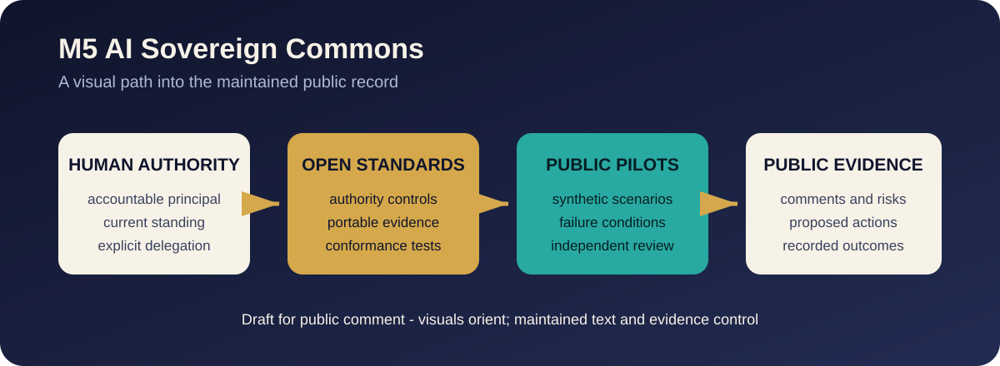

# Documentation Map

This folder contains the maintained architecture and public-review profiles.
Use this page to choose a path before opening the detailed source documents.

## Choose a path

| Path | Start with | Then review |
| --- | --- | --- |
| Authority and agents | [M5AGT Authority and Activation](M5AGT-AUTHORITY-AND-ACTIVATION.md) | [M5Canon Function Namespace](M5CANON-FUNCTION-NAMESPACE.md) and [Named Role Crosswalk](NAMED-ROLE-FUNCTION-CROSSWALK.md) |
| Human refusal and consent | [M5HUM Refusal and Consent Profile](M5HUM-REFUSAL-CONSENT-PROFILE.md) | [M5POD Data Portability Profile](M5POD-DATA-PORTABILITY-PROFILE.md) and [M5-AISPACE-001](../standards/M5-AISPACE-001.md) |
| Open standards and portability | [Open Standards Evidence Registry](OPEN-STANDARDS-EVIDENCE-REGISTRY.md) | [M5POD Data Portability Profile](M5POD-DATA-PORTABILITY-PROFILE.md) |
| Activation and M5-CV | [Activation Pathway](activation/README.md) | [Canonical public links](activation/CTA-LINKS.md) and [People's Trust bridge](../pilots/peoples-trust/ACTIVATION-BRIDGE.md) |
| Communications | [Sovereign Communications Profile](SOVEREIGN-COMMUNICATIONS-PROFILE.md) | [Threat Model](../THREAT-MODEL.md) |
| Money, rights, and jurisdiction | [Value Instrument and Jurisdiction Model](VALUE-INSTRUMENT-AND-JURISDICTION.md) | [Draft schemas](../schemas/README.md) and [synthetic examples](../examples/README.md) |
| Outreach routing | [TitleChain Foundation — Outreach Routing / SPRING · FARM · GLOBAL · SHADOW](OUTREACH-ROUTING.md) | [SPRING](../pilots/312-spring-commons/documents/summaries/SPRING-INITIAL-CAPITAL-TRANCHE-BRIEF.md), [FARM](../pilots/peoples-trust/CAPITAL-AND-OPERATING-PARTNER-BRIEF.md), [GLOBAL](../pilots/global-un-commons/FOUNDING-INSTITUTIONAL-UNDERWRITER-BRIEF.md), and [SHADOW](../shadow-m5index/README.md) |
| People's Trust pilot | [Visual Pilot Library](../pilots/peoples-trust/README.md) | [Pilot specification](PEOPLES-TRUST-PUBLIC-PILOT.md) |
| Project simulations | [Public Pilot Library](../pilots/README.md) | [312 Spring Commons](../pilots/312-spring-commons/README.md), [America's People's Trust Farmland](../pilots/peoples-trust/README.md), and [Global UN Commons](../pilots/global-un-commons/README.md) |
| SHADOW public research | [SHADOW M5Index](../shadow-m5index/README.md) | [Public ingestion and QR architecture](SHADOW-M5INDEX-PUBLIC-INGESTION-AND-QR.md) and [engineering epic](SHADOW-M5INDEX-ENGINEERING-EPIC.md) |
| SEC public input | [SEC Public Input Summary](../sec-public-input/README.md) | [Pilot and SEC RFI Crosswalk](PILOT-SEC-RFI-CROSSWALK.md) |

## How to read this repository

1. **Visual landing pages orient.** They explain the public-review path and link
   to the controlling source text.
2. **Maintained Markdown defines the proposal.** Visual shorthand never
   overrides the normative or informative status of a document.
3. **Schemas and examples make claims inspectable.** Examples are synthetic
   unless a document explicitly states otherwise.
4. **Tests demonstrate bounded cases.** Passing tests do not establish legal
   compliance, certification, production readiness, or external approval.
5. **Discussions and Issues collect criticism.** A comment becomes part of the
   maintained proposal only through review and an attributable change.

## Current public workspaces

| Workspace | Role | State |
| --- | --- | --- |
| [People's Trust Discussion #1](https://github.com/TitleChain-Foundation/M5-AI-Sovereign-Commons/discussions/1) | Public pilot questions and evidence | Open |
| [SEC Transfer Agent Rules Project #2](https://github.com/orgs/TitleChain-Foundation/projects/2/views/2) | Seven scoped SEC public-review work items | Active |

The organization also has an empty legacy Project #1. It is not a People's
Trust board, is not part of this release, and is intentionally not presented as
a current Commons review path.

## Publication boundary

Do not place credentials, personal data, confidential pilot records, private
communications, production secrets, or vulnerability details in public
Discussions or Issues. See [Security](../SECURITY.md) and the
[Code of Conduct](../CODE_OF_CONDUCT.md).

## September 23 contract and baseline additions

- [EXTERNAL-REFERENCE-REVIEW-2026-09-22](EXTERNAL-REFERENCE-REVIEW-2026-09-22.md)
- [JEV-HOSTED-SYSTEM-ONE-PROFILE](JEV-HOSTED-SYSTEM-ONE-PROFILE.md)
- [LAYA-LOCAL-SYSTEM-ONE-PROFILE](LAYA-LOCAL-SYSTEM-ONE-PROFILE.md)
- [M5-CANONICAL-CONTEXT-V1-V2-MIGRATION](M5-CANONICAL-CONTEXT-V1-V2-MIGRATION.md)
- [M5-CONFORMANCE-AND-NAMESPACE-BOUNDARIES](M5-CONFORMANCE-AND-NAMESPACE-BOUNDARIES.md)
- [M5-CREDENTIAL-TRUST-AND-JURISDICTION-BINDING](M5-CREDENTIAL-TRUST-AND-JURISDICTION-BINDING.md)
- [M5-EVE-CREDENTIALED-ACTIVATION-ARCHITECTURE](M5-EVE-CREDENTIALED-ACTIVATION-ARCHITECTURE.md)
- [M5-INTELLIGENCE-ROUTER-AND-M5POD-RUNTIME](M5-INTELLIGENCE-ROUTER-AND-M5POD-RUNTIME.md)
- [M5-OPENAPI-EARLY-ACCESS-AND-DEMAND-PILOT](M5-OPENAPI-EARLY-ACCESS-AND-DEMAND-PILOT.md)
- [M5-OPENAPI-METERING-X402-COMMERCE](M5-OPENAPI-METERING-X402-COMMERCE.md)
- [M5-PROVIDER-ACCOUNT-STANDING-AND-ENDPOINT-PROFILE](M5-PROVIDER-ACCOUNT-STANDING-AND-ENDPOINT-PROFILE.md)
- [M5-REFERENCE-PRICING-AND-DEMAND-MEASUREMENT](M5-REFERENCE-PRICING-AND-DEMAND-MEASUREMENT.md)
- [M5-TRANSACTION-FOOTPRINT-AND-ECONOMIC-CLASSIFICATION](M5-TRANSACTION-FOOTPRINT-AND-ECONOMIC-CLASSIFICATION.md)
- [M5BOM-ACTIVATION-AND-SOVEREIGN-BASELINE](M5BOM-ACTIVATION-AND-SOVEREIGN-BASELINE.md)
- [ORBITALYS-EVENT-THREAT-PLANE](ORBITALYS-EVENT-THREAT-PLANE.md)

- [September 23 validation evidence](COMMONS-BASELINE-VALIDATION-2026-09-23.md).
