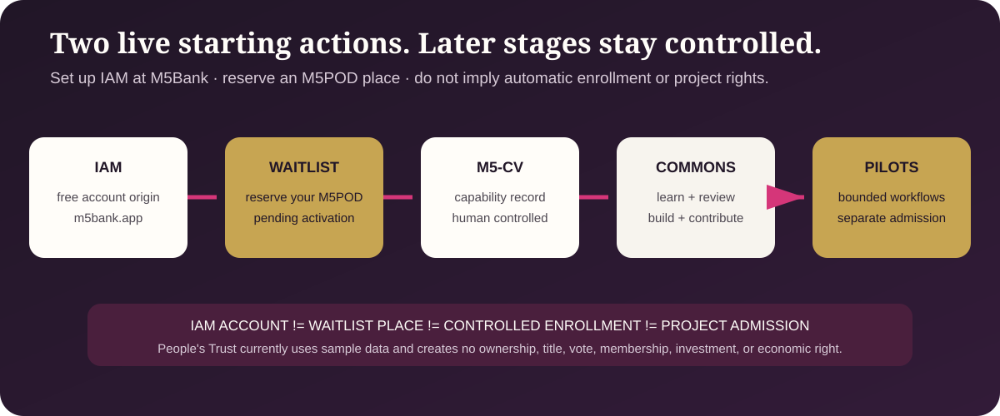

# Public Activation Pathway



**Status:** Two public starting actions are live: setting up an IAM account at
M5Bank and reserving an M5POD place on the waitlist. Future enrollment and
activation stages are not publicly open. This page does not announce an open
cohort, approve an applicant, issue a credential, activate an M5POD, or admit
anyone to a project.

## One connected path

```text
free IAM account at m5bank.app
        +
public M5POD waitlist
        |
        v
future controlled enrollment, consent, and approval when opened
        |
        v
M5-CV capability record
        |
        v
Public Commons learning, review, and contribution
        |
        v
bounded pilots and project workflows with their own admission rules
```

- **M5-CV is the person's capability record.**
- **The Public Commons is the open place to learn, review, build, and
  contribute.**
- **People's Trust is the first public sample-data pilot.**
- **Underwriting may support activation, training, review, and measurement but
  cannot purchase an outcome, credential, admission decision, or finding.**

## Two live public starting actions

1. **[Set up your IAM account at M5Bank](https://m5bank.app/)**
2. **[Reserve your M5POD place](https://m5podactivationdemo.netlify.app/)**

The IAM account is the free identity/account starting point. The waitlist holds
a place and collects the approved minimum information for a pending M5POD
pathway. Neither action issues a credential, activates an M5POD, creates
membership, assigns a role, or creates a project right.

No other enrollment, demo, member, passport, cohort, or activation URL is a
current public CTA. Future controlled stages may be documented without a live
link and should be published only when the accountable owner confirms that the
stage is open and its notice, consent, eligibility, approval, privacy, and
support controls are in place.

See the [canonical CTA registry](CTA-LINKS.md) before adding or changing a
public activation link.

## From capability to public projects

The Commons is open for public review without enrollment. A participant may
choose to build an M5-CV and use it to organize portable evidence of capability,
but a capability record does not itself create a job, authority, credential,
membership, title, or economic right.

The [People's Trust Activation Bridge](../../pilots/peoples-trust/ACTIVATION-BRIDGE.md)
shows how capability categories can be mapped into a bounded pilot workflow.

## People's Trust boundary

People's Trust currently uses sample, non-production records. Reviewing the
pilot, joining the waitlist, building an M5-CV, or contributing in the Commons
does not itself create:

- title or ownership;
- cooperative or DUNA membership;
- a vote or governance authority;
- an investment, distribution, or economic right;
- admission to a future project; or
- authority to act for another person or entity.

Any future cooperative, operating entity, project, or economic participation
requires its own adopted legal and governance structure, eligibility,
affirmative consent, accountable authority, disclosures, and recorded
admission.
