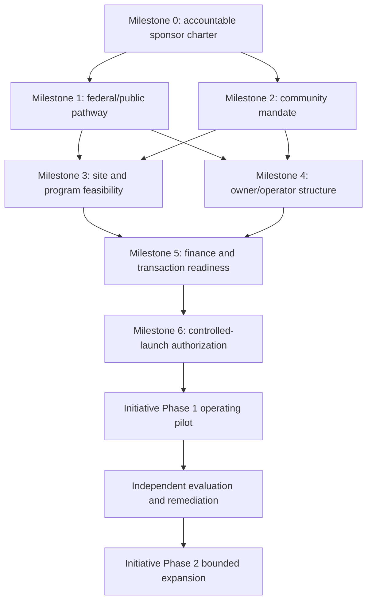

# 312 Spring Commons Initiative Fit-Gap Review

**Project:** PPT-EZ-CA-0001 / 312 Spring Commons  
**Review date:** September 21, 2026  
**Review status:** Draft planning assessment for accountable human, community, public-agency, counsel, professional, and technical review  
**Decision posture:** `NO-GO` for transaction launch; `CONDITIONAL GO` for a bounded diligence and co-design phase

> This review evaluates the public repository against the stated initiative vision. It is not a title report, legal opinion, agency determination, community mandate, feasibility study, financing commitment, procurement decision, or authorization to solicit capital, enter the property, move funds, or begin work.

## 1. Review scope and evidence rule

The review uses only repository evidence available on the review date, principally:

- the [Spring Commons overview](README.md);
- the [23-document draft library](documents/README.md);
- the [Authority + Participant Registry template](update-notes/AUTHORITY-AND-PARTICIPANT-REGISTRY-TEMPLATE.md);
- the [v0.6 release notes](update-notes/V0.6-RELEASE-NOTES.md) and [cross-document map](update-notes/V0.6-CROSS-DOCUMENT-UPDATE-MAP.md);
- the [GSA pathway and application-readiness checklist](update-notes/GSA-PATHWAY-AND-APPLICATION-READINESS.md);
- the [first-tranche simulation](simulations/first-tranche/README.md);
- the [stakeholder and checkpoint matrix](simulations/first-tranche/STAKEHOLDER-CHECKPOINT-MATRIX.md); and
- the [executable settlement architecture](simulations/first-tranche/EXECUTABLE-SETTLEMENT-ARCHITECTURE.md).

Repository presence proves that a draft, schema, fixture, or test exists. It does not prove that an external fact is true or that an accountable party has approved it. In particular:

- `SIMULATED_PASS` means a bounded internal rule passed; it is not an agency, legal, professional, fiduciary, community, bank, or investor approval.
- `PENDING_EXTERNAL` means authoritative evidence has not been supplied.
- A proposed role, account, credential, or workflow is not active until its legal source, accountable human, scope, status, and system of record are verified.

### Assessment scale

| Rating | Meaning |
| --- | --- |
| **FIT** | The repository materially expresses the vision and has inspectable supporting artifacts. |
| **PARTIAL FIT** | The intended design is visible, but a key definition, governing decision, implementation artifact, or external proof is missing. |
| **GAP** | The capability or commitment is not yet adequately specified or evidenced. |
| **BLOCKED** | A prerequisite outside the repository must be resolved before the initiative can advance through the relevant gate. |

## 2. Executive finding

The initiative has a **strong conceptual fit** with a community-first, human-accountable civic commons. It preserves public fee title in the working model; separates people, roles, institutions, automated agents, and legal authority; proposes community, worker, resilience, education, and local-enterprise benefits; and includes unusually strong fail-closed evidence controls for a draft-stage project.

It does **not yet have implementation fit** for a controlled real-world transaction launch. The public pathway is unconfirmed, no eligible public grantee or operator is selected, the authority registry contains no active participants, community decision rights have not been adopted, site and program feasibility remain unverified, financing terms are illustrative, and all consequential first-tranche checkpoints depend on external evidence. The code correctly returns `HOLD`; that is evidence of safe simulation behavior, not project readiness.

The appropriate next state is therefore:

1. treat **Initiative Phase 1** as a controlled, non-transactional diligence and community co-design launch;
2. prohibit capital solicitation, commitments, escrow funding, procurement awards, property work, or production credentialing during that phase;
3. require explicit exit evidence before any transaction preparation or physical activation; and
4. defer **Initiative Phase 2** expansion until public authority, governance, feasibility, delivery capacity, and financeability are established.

## 3. Vision fit assessment

### 3.1 Community-first and human-accountable model

| Vision requirement | Existing fit | Gap | Rating |
| --- | --- | --- | --- |
| Public land remains protected from speculative fractionalization | The overview states that the public keeps the land and that participation does not create fractional deed interests. DOC-04, DOC-18, and the simulation preserve title/lease/instrument separation. | The eligible public owner, conveyance restrictions, lease structure, and enforcement rights are not established. | **PARTIAL FIT / BLOCKED** |
| Humans and accountable institutions retain authority | The M5BOM-to-role model, authority registry, M5Canon gates, and write-disabled simulation all preserve human/institutional authority. | No accountable project sponsor, authorized signer, governing body, or active authority record has been verified. | **FIT in design; BLOCKED in operation** |
| Community benefit is a first-order purpose | The productive-asset thesis includes services, workforce, food, resilience, education, small business, and reinvestment. | No adopted community-benefit agreement, baseline needs assessment, priority-setting process, beneficiary definition, or enforcement mechanism exists in repository evidence. | **PARTIAL FIT** |
| Community members have meaningful governance | DOC-19 and M5BOU contemplate membership, federated governance, conflicts, and due process. | Membership eligibility, reserved powers, voting/consent rights, representation, accessibility, removal, appeals, and anti-capture safeguards are not adopted or evidenced through community co-design. | **GAP** |
| Workers have protected, non-tokenized rights | DOC-14 and the checkpoint matrix separate wages, work, credential, correction, participation, security, and title rights. | Labor model, employer(s), bargaining/representation pathway, wage standards, procurement commitments, and grievance operations remain undefined. | **PARTIAL FIT** |
| Technology supports rather than governs people | The repository repeatedly states that AI, credentials, wallets, code, and chains do not create authority. Automated execution is disabled. | Production product ownership, accessibility, human support, incident response, appeal handling, data stewardship, and independent oversight are not assigned. | **FIT in principle; GAP in operations** |
| Benefits are measurable and auditable | DOC-21 and the overview identify energy, water, food, compute, circularity, economic, workforce, and community metrics. | Baselines, target owners, methods, data rights, audit frequency, materiality thresholds, and remedies for missed targets are not adopted. | **PARTIAL FIT** |
| Replication serves additional communities | M5BOU portability, the Opportunity Registry concept, and DOC-23 implementation Phase 5 anticipate replication. | There is no validated first-site operating model, replication standard, local adaptation protocol, funding model, or evidence that another community has requested adoption. | **GAP; premature** |

### 3.2 Required clarification of “human-owned”

The phrase **human-owned** is directionally aligned with the project’s rejection of autonomous machine authority, but it is legally and operationally ambiguous. It could be misconstrued as individual or member ownership of the land, instruments, project revenue, data, or governance rights.

Before external use, accountable participants should adopt a precise definition. The recommended formulation is:

> **Human-accountable, community-benefit, publicly stewarded:** natural persons act through verified roles in accountable legal institutions; automated systems hold no independent authority; public fee title and restrictions remain controlling; and community participation or membership creates only the rights expressly granted by adopted governing or contractual instruments.

This wording should not be used as a legal conclusion until the public owner, governance documents, and community representatives approve it.

## 4. Current-state capability assessment

| Capability | Repository evidence | Current state | What remains |
| --- | --- | --- | --- |
| Vision and public-purpose narrative | Overview, productive loop, public-benefit allocation, metrics | **Documented** | Community validation and accountable adoption |
| Legal/process document coverage | Master index and DOC-01 through DOC-23 | **Draft coverage** | Counsel revision, counterparties, approvals, execution, consistency review |
| Authority model | M5BOM/BOB/BOI/BOG/BOU, DOC-17, registry template | **Designed** | Named institutions, humans, source records, terms, revocation, co-approvals |
| Public-property pathway | Historic Surplus working hypothesis | **Unconfirmed** | GSA/NPS determination, title evidence, eligibility, restrictions, public process |
| Community governance | DOC-19 and participation concepts | **Conceptual** | Co-designed charter, representation, decision rights, accountability, appeals |
| Site and program feasibility | Candidate productive engines and risk list | **Hypothetical** | Surveys, engineering, preservation, code, utilities, market, operating studies |
| Capital architecture | Blended-stack concepts and illustrative $25M tranche | **Modeled only** | Uses/sources, cost plan, instrument, economics, counsel, providers, commitments |
| Provenance and evidence controls | DOC-10, DOC-16, DOC-17, DOC-20, DOC-23, schemas | **Strong draft fit** | Production threat model, privacy assessment, integrations, operations, assurance |
| Deterministic gating | Schemas, fixtures, Python evaluator, Numscript, M5-x402 | **Demonstrated offline** | Production adapters, trusted time, keys, custody, monitoring, incident recovery |
| Records and receipts | Schema-valid `HOLD` receipts and access policy | **Demonstrated for synthetic data** | Authoritative source integration, retention, disclosure, reconciliation, audit |
| Operating organization | Candidate public owner/operator/fiduciary roles | **Not formed/selected** | Entity structure, leadership, staffing, controls, insurance, service providers |
| Phase 2 replication | Federated registry and research concepts | **Concept only** | Successful Phase 1 evidence, replication criteria, demand, capital, local consent |

## 5. Critical gaps and blockers

### B1 — Public disposition pathway and title basis

**Why it blocks:** The proposed public-title architecture depends on the federal Historic Surplus pathway or another lawful disposition route. Without an authoritative pathway determination, the project cannot establish the eligible recipient, restrictions, approvals, schedule, or permissible operating structure.

**Evidence required to clear:**

- current authoritative title, legal description, survey references, retained interests, and property status;
- written GSA/NPS pathway guidance or a formal process record;
- eligibility criteria and evidence for the proposed grantee;
- preservation/public-use restrictions and approval map; and
- accountable federal contacts and systems of record.

**Owner:** prospective public sponsor with federal real-property and preservation counsel.  
**Blocks:** all transactional and site-activation milestones.

### B2 — Eligible public grantee and accountable sponsor

**Why it blocks:** The repository identifies no entity with an adopted mandate to receive title, sponsor diligence, engage counterparties, or own project decisions.

**Evidence required to clear:**

- selected eligible public entity and governing-body authorization;
- named accountable executive and project director;
- authority and procurement basis for predevelopment work;
- approved scope, budget, conflicts policy, and records obligations; and
- completed active rows in the Authority + Participant Registry.

**Owner:** eligible public entity and its governing body.  
**Blocks:** counsel engagement, site access, procurement, grants, operator selection, and transaction design.

### B3 — Community mandate and governance legitimacy

**Why it blocks:** “Community-first” cannot be validated by document design alone. No repository evidence shows who the affected community is, how participants were reached, which needs were prioritized, or what powers they hold.

**Evidence required to clear:**

- stakeholder and affected-community map, including historically excluded groups;
- accessible, multilingual engagement and compensation plan;
- published input record and response-to-comments log;
- adopted community-benefit principles and measurable priorities;
- governance charter defining reserved decisions, representation, conflicts, removal, appeal, and amendment; and
- independent facilitation or accountability mechanism.

**Owner:** public sponsor with a community steering body selected through a documented process.  
**Blocks:** final program, operator mandate, benefit allocation, governance launch, and replication claims.

### B4 — Physical, historic, regulatory, and operating feasibility

**Why it blocks:** Productive engines are candidates, not validated uses. Historic compatibility, structural capacity, life safety, accessibility, utilities, environmental conditions, operating demand, and lifecycle costs may materially alter or eliminate them.

**Evidence required to clear:**

- controlled site access and records review;
- condition, structural, seismic, MEP, environmental, accessibility, and hazardous-material assessments;
- historic-preservation and code pathway;
- utility/interconnection, water, food-safety, communications, and cybersecurity feasibility as applicable;
- space program and demand validation;
- independent capital and operating cost plans with contingencies; and
- phased schedule and risk-adjusted operating model.

**Owner:** public sponsor and independently retained licensed professionals.  
**Blocks:** final scope, cost, schedule, financing, procurement, and performance targets.

### B5 — Legal delivery and operating structure

**Why it blocks:** The relationship among public owner, Public Trust of America, operator, rehabilitation vehicle, tenants, members, workers, and capital providers remains conceptual.

**Evidence required to clear:**

- counsel-approved entity and contract map;
- owner/operator/asset-manager responsibilities and removal rights;
- lease or operating-right structure consistent with federal restrictions;
- fiduciary duties, conflicts, procurement, records, transparency, and insolvency rules;
- allocation of maintenance, preservation, insurance, compliance, and reserve obligations; and
- explicit separation of membership, employment, service access, investment, and title rights.

**Owner:** public sponsor, governance representatives, and qualified counsel.  
**Blocks:** operator onboarding, definitive documents, capital structure, and operations.

### B6 — Financeability and regulated-provider route

**Why it blocks:** The $200M–$240M envelope and $25M tranche are planning scenarios, not independently costed or underwritten. No issuer, instrument, bank/escrow, counsel route, tax structure, or capital provider is active.

**Evidence required to clear:**

- independently reviewed sources-and-uses model tied to the feasible scope;
- predevelopment funding that does not presume closing;
- selected instrument and legal/tax/regulatory analysis;
- current risk disclosures and downside cases;
- selected bank/escrow and any required regulated intermediaries;
- provider authority, KYC/KYB/AML, source-of-funds, conflict, and side-arrangement evidence; and
- definitive approval and condition-precedent matrix.

**Owner:** authorized project entity, finance lead, counsel, tax adviser, and selected regulated participants.  
**Blocks:** solicitation, commitment, subscription, escrow, draw, or financial close.

### B7 — Production governance, privacy, and security

**Why it blocks production, but not paper-based diligence:** The public code demonstrates fail-closed policy behavior; it does not supply a production control environment.

**Evidence required to clear:**

- product/system owner and accountable security/privacy officers;
- data inventory, lawful basis, minimization, retention, access, correction, and deletion rules;
- threat model for deployed architecture and independent security review;
- key/custody, trusted-time, identity proofing, recovery, monitoring, incident, and vendor controls;
- authoritative-source adapters and reconciliation procedures;
- accessibility and non-digital service paths; and
- tested continuity, manual override, appeal, and breach response.

**Owner:** authorized operator and public owner, with independent assurance.  
**Blocks:** production credentials, private evidence processing, automated routing, and live settlement integration.

## 6. Initiative milestone plan

The milestones below govern **initiative delivery**. They are distinct from the “Phase 1–5” capital-provenance implementation sequence in DOC-23 section 22.

### Milestone 0 — Sponsor charter and language control

**Purpose:** establish who may make planning decisions and what claims may be made.

**Deliverables**

- accountable sponsor and project director;
- approved project charter, decision log, records policy, and budget authority;
- adopted definitions for “commons,” “human-accountable,” “community-first,” “publicly stewarded,” “member,” and “ownership”;
- claims register separating proposal, scenario, verified fact, approval, commitment, and measured result; and
- conflict-of-interest disclosures for the initial team.

**Exit gate:** governing body or otherwise authorized sponsor approves the charter and names the humans responsible for each decision domain.

**Current assessment:** **GAP / BLOCKED** — narrative boundaries exist, but no authorized sponsor charter is evidenced.

### Milestone 1 — Public pathway and asset diligence authorization

**Purpose:** establish whether there is a lawful, actionable path worth diligencing.

**Deliverables**

- authoritative title/property record set;
- GSA/NPS process and eligibility confirmation;
- candidate public grantee legal-capacity memorandum;
- preliminary approval, notice, environmental-review, preservation, and procurement map;
- approved site-access and records protocol; and
- red/amber/green fatal-flaw memorandum.

**Exit gate:** accountable public counsel and sponsor confirm a viable diligence path, without representing that conveyance is approved.

**Current assessment:** **BLOCKED** — this is the primary external dependency.

### Milestone 2 — Community mandate and governance design

**Purpose:** turn community-first intent into accountable rights and decisions.

**Deliverables**

- affected-community and stakeholder map;
- accessible engagement plan, participation safeguards, and compensation policy;
- needs baseline and alternatives analysis, including a no-project option;
- community design principles and benefit priorities;
- draft governance charter and community-benefit agreement framework; and
- published input/response ledger with privacy protections.

**Exit gate:** a documented representative process endorses the design principles and governance proposal; unresolved dissent and tradeoffs remain visible.

**Current assessment:** **GAP** — should begin in parallel with Milestone 1, but must not presume site control.

### Milestone 3 — Feasible program and operating case

**Purpose:** replace the broad productive-asset thesis with a technically, historically, operationally, and financially coherent program.

**Deliverables**

- professional site assessments;
- preservation-compatible program options;
- demand and partner validation for each retained productive engine;
- energy/water/food/compute load and resilience studies where retained;
- accessibility, life-safety, environmental, cybersecurity, and operational requirements;
- independent capital-cost, operating-cost, revenue, reserve, and contingency models; and
- recommended minimum viable activation scope with alternatives.

**Exit gate:** sponsor, public owner candidate, community governance body, and independent professionals approve one bounded program for transaction structuring.

**Current assessment:** **GAP / BLOCKED by site access and authority**.

### Milestone 4 — Delivery entity and control environment

**Purpose:** assign duties, liabilities, controls, and operating accountability.

**Deliverables**

- approved owner/operator/entity map;
- governing documents and reserved powers;
- procurement, conflicts, related-party, transparency, records, and whistleblower policies;
- staffing and service-provider plan;
- insurance and risk-allocation plan;
- privacy/security/accessibility operating requirements; and
- populated Authority + Participant Registry for active planning roles.

**Exit gate:** every consequential function has an accountable institution, human, authority source, scope, status, and system of record.

**Current assessment:** **PARTIAL design / GAP implementation**.

### Milestone 5 — Finance and transaction readiness

**Purpose:** determine whether the feasible, governed program can be lawfully financed.

**Deliverables**

- approved sources-and-uses and operating model;
- capital-stack options with constraints, costs, control effects, and downside cases;
- selected legal, tax, securities, public-finance, and procurement routes;
- updated DOC-01 through DOC-23 terms aligned to the selected route;
- selected regulated/professional participant classes and diligence plans;
- instrument-specific risk, eligibility, transfer, custody, escrow, draw, and reporting design; and
- complete condition-precedent and authority matrix.

**Exit gate:** independent advisers and accountable decision-makers approve entry into definitive negotiation. This gate does not itself authorize an offering or closing.

**Current assessment:** **MODELED ONLY / BLOCKED by Milestones 1–4**.

### Milestone 6 — Initiative Phase 1 controlled-launch authorization

**Purpose:** authorize a deliberately bounded operating pilot after the foundations above are real.

**Minimum entry evidence**

- Milestones 0–5 approved with no unresolved fatal blocker;
- written scope of permitted activities and prohibited activities;
- named operator, public oversight body, community oversight body, and accountable humans;
- approved budget and source of predevelopment/pilot funds;
- required permits, insurance, contracts, and site controls for the bounded scope;
- production security/privacy readiness only for systems actually deployed;
- incident, grievance, appeal, correction, and stop-work procedures; and
- baseline metrics and public reporting calendar.

**Exit gate:** formal human and institutional authorization recorded in controlling systems of record, with a public summary that distinguishes approvals from pending items.

**Current assessment:** **NO-GO**.

## 7. Initiative Phase 1 — controlled launch

### 7.1 Recommended initial scope now

Until Milestone 6 is cleared, the only appropriate “launch” is a **controlled diligence and co-design program**:

- public listening and needs assessment;
- agency/pathway inquiry and public-record collection;
- non-invasive desktop feasibility and alternatives work;
- governance, benefit, accessibility, privacy, and operating-design workshops;
- synthetic/offline testing of schemas, receipts, authority failures, and reporting;
- partner capability discovery without selection or implied endorsement; and
- publication of a verified-facts register, decisions, open questions, and corrections.

### 7.2 Explicit exclusions

Phase 1 must not include, unless separately and lawfully authorized after the relevant gate:

- representation that conveyance, site control, public sponsorship, permits, or financing exists;
- securities offering, general solicitation, subscription, capital commitment, escrow funding, or draw;
- construction, installation, occupancy, site entry, or procurement award;
- production identity, KYC/KYB, bank, regulator, or protected community data in the public repository;
- live wallet, chain, bank, x402 facilitator, or settlement connection;
- vendor selection disguised as a pilot partnership;
- claims of community consent based only on attendance, platform membership, or token/account possession; or
- claims that modeled energy, water, food, compute, jobs, revenue, or impact has been achieved.

### 7.3 Phase 1 workstreams and success measures

| Workstream | Phase 1 output | Minimum success measure |
| --- | --- | --- |
| Public pathway | Verified process and decision map | Every required agency decision has an owner, authority source, status, and evidence location |
| Community co-design | Needs baseline and governance proposal | Participation coverage and exclusions disclosed; comments receive attributable disposition |
| Program feasibility | Options and fatal-flaw analysis | Each retained use has professional, preservation, utility, demand, and operating evidence |
| Governance | Charter and reserved-power matrix | No material decision lacks an accountable human/institution or appeal path |
| Delivery model | Owner/operator/control design | Duties, liabilities, procurement, conflicts, records, privacy, and removal rights are explicit |
| Finance | Independent options model | Costs, sources, restrictions, downside cases, and control effects reconcile |
| Evidence systems | Synthetic and shadow-mode validation | All unresolved, stale, revoked, malformed, wrong-route, or unauthorized cases fail closed |
| Public reporting | Versioned readiness dashboard | Claims link to sources; pending and rejected items are as visible as approved items |

### 7.4 Phase 1 stop conditions

The sponsor should pause or narrow the initiative if any of the following occurs:

- the disposition pathway is unavailable or incompatible with the public-benefit model;
- no eligible and willing public grantee can be authorized;
- preservation, safety, environmental, utility, or cost findings make the proposed program infeasible;
- community process rejects the proposed direction or reveals material unaddressed harm;
- governance or financing rights would defeat public title, public benefit, or accountable human control;
- predevelopment funding is unavailable without premature transaction claims;
- protected data cannot be handled lawfully and safely; or
- material conflicts or side arrangements cannot be disclosed and governed.

## 8. Initiative Phase 2 — bounded expansion

Phase 2 is not “scale the concept.” It is **expand only the components proven lawful, useful, governable, financeable, and measurable during Phase 1**.

### 8.1 Entry criteria

- a lawful property and operating pathway is active;
- accountable public owner and operator are in place;
- community governance and benefit commitments are adopted and funded;
- required permits, contracts, insurance, and regulated providers are active;
- the controlled launch has at least one complete reporting cycle;
- material incidents, grievances, exceptions, and audit findings are closed or accepted by authorized parties;
- actual cost, schedule, service, workforce, resilience, and community data is available; and
- expansion does not compromise preservation, life safety, affordability, privacy, public title, or core services.

### 8.2 Expansion sequence

1. **Stabilize core civic operations** — safety, access, preservation, maintenance, governance, records, and community support.
2. **Expand proven service lines** — add only uses with demonstrated demand, operating ownership, compliance, and unit economics.
3. **Add infrastructure in reversible increments** — meter energy, water, food, compute, and circular systems separately before coupling them.
4. **Broaden capital lanes cautiously** — use definitive instruments and regulator/qualified-provider routes; preserve public-title and benefit restrictions.
5. **Federate learning, not authority** — share schemas, methods, and de-identified results while each future commons establishes its own legal authority and community mandate.
6. **Consider replication** — only after independent evaluation shows which outcomes are attributable, durable, and transferable.

### 8.3 Phase 2 decision gates

| Gate | Required evidence | Decision |
| --- | --- | --- |
| Service expansion | Demand, compliance, staffing, accessibility, unit economics, community priority | Continue, redesign, defer, or stop each service independently |
| Capital expansion | Actual performance, updated risk, lawful instrument, provider readiness, benefit impact | Approve only capital compatible with public controls |
| Technology expansion | Security/privacy review, interoperability, manual fallback, measured benefit | Deploy, sandbox, or reject each capability |
| Geographic replication | Local sponsor, local authority, local co-design, local feasibility, funding | Start a separate local gate process; never inherit authority from Los Angeles |
| Research/index publication | Method, source lineage, privacy threshold, correction process | Publish only appropriately labeled and non-identifying outputs |

## 9. Dependency map and critical path

### Dependency rules

- Community co-design begins early and runs in parallel; it is not a communications task appended after feasibility or financing.
- Site feasibility cannot be inferred from conceptual vendor technologies or generic building benchmarks.
- Capital structure follows the lawful pathway, community mandate, feasible scope, and delivery model—not the reverse.
- Technology selection follows operating requirements and threat/privacy assessment; it must not determine governance.
- A successful code test can clear a software criterion only. It cannot clear an external authority or project gate.
- DOC-23 implementation phases may proceed as schema/governance research, but live participant and capital graphs depend on lawful roles and protected-data controls.

## 10. Decision rights and accountability

Before Phase 1, the sponsor should approve a decision-rights matrix at least as explicit as the following:

| Decision domain | Accountable decision-maker | Required consultation or concurrence | Evidence source |
| --- | --- | --- | --- |
| Federal disposition and preservation | GSA/NPS within their lawful roles | Public grantee and counsel | Official agency record |
| Acceptance of public title and restrictions | Eligible public grantee governing body | Counsel, community process, finance/professional advisers | Resolution and conveyance record |
| Community priorities and benefit commitments | Defined community governance body plus public owner | Affected groups, workers, operator | Adopted charter/agreement and public record |
| Program and preservation scope | Public owner | Community body, operator, architects/engineers, NPS as applicable | Approved program and professional record |
| Operator selection and removal | Public owner under adopted process | Community body and procurement/conflict review | Public procurement/governance record |
| Financing and instrument approval | Authorized issuer/borrower and public owner as applicable | Counsel, fiduciaries, tax advisers, regulated providers | Resolutions and definitive instruments |
| Escrow and draw | Authorized humans named in definitive documents | Certifying professionals, bank/escrow, fiduciaries | Bank/escrow and project records |
| Production system and data use | Authorized operator/public owner | Privacy, security, accessibility, legal, community oversight | Approved policy and audit record |
| Automated recommendation | No independent authority | Human/institutional review required | M5 receipt plus authoritative decision |
| Expansion or replication | Applicable local accountable bodies | Local community and professional review | New local authorization; never inherited automatically |

No party should be listed as “responsible” merely because it appears in a concept document. Responsibility begins with an accepted appointment, contract, resolution, statutory role, or other authoritative source.

## 11. Readiness dashboard

| Gate | Status on review date | Blocking evidence |
| --- | --- | --- |
| Repository architecture and draft controls | **READY FOR PUBLIC/TECHNICAL REVIEW** | Continued review and change control |
| Offline fail-closed simulation | **DEMONSTRATED** | Does not confer external readiness |
| Sponsor charter | **NOT READY** | Authorized sponsor, owners, budget, decision rights |
| Federal/public pathway | **BLOCKED** | GSA/NPS and title evidence |
| Public grantee | **BLOCKED** | Selection, eligibility, governing authorization |
| Community mandate | **NOT READY** | Representative co-design and adopted governance |
| Site/program feasibility | **BLOCKED** | Access, professional studies, alternatives, cost plan |
| Operator/delivery structure | **NOT READY** | Entity, duties, controls, staffing, insurance |
| Finance/transaction | **NOT READY** | Feasible scope, legal route, providers, definitive terms |
| Production M5/TitleChain deployment | **NOT READY** | Governance, privacy/security, integrations, assurance |
| Initiative Phase 1 controlled operations | **NO-GO** | Milestones 0–6 |
| Initiative Phase 2 expansion | **PREMATURE** | Phase 1 results and independent evaluation |

## 12. Recommended next actions

### Immediate sequence

1. Secure an accountable sponsor for a bounded predevelopment and public-process mandate.
2. Open the Authority + Participant Registry as a controlled project record; do not mark a role `ACTIVE` without authoritative evidence.
3. Request formal pathway and property information from GSA/NPS and obtain qualified public-real-estate/preservation counsel.
4. Establish an independent, accessible community co-design process before selecting the final program or operator.
5. Commission fatal-flaw and alternatives work before refining the capital stack.
6. Convert the 23-document package from generic placeholders to a controlled issue list tied to responsible reviewers and decisions.
7. Maintain the technical demonstrator in synthetic/shadow mode; add production design only after actual systems of record and operators are known.
8. Publish a versioned readiness dashboard showing evidence, owner, status, dependency, decision date, and correction history.

### Evidence-first sequencing rule

For every milestone item, record:

`claim → source → source class → accountable owner → reviewer → decision → effective period → access class → correction/supersession link`

If any required element is missing, the item remains pending. Silence, a draft document, an account identifier, or a software pass must never be converted into approval.

## 13. Final fit-gap verdict

The 312 Spring Commons package is **well aligned as a public-interest design and control architecture**. Its strongest fit is the explicit preservation of public title, accountable human authority, separable rights, regulator/provider boundaries, evidence provenance, privacy planes, and fail-closed simulation behavior.

Its largest gap is not another schema or transaction document. It is the absence of an authorized public sponsor, confirmed federal pathway, representative community mandate, verified site/program feasibility, adopted governance, accountable operator, and financeable delivery plan.

Accordingly:

- **Continue** public review, agency inquiry, community co-design, professional diligence, and synthetic technical testing.
- **Do not declare** the initiative ready for conveyance, offering, funding, procurement, construction, production credentialing, settlement, or operational launch.
- **Authorize Initiative Phase 1 only** after Milestones 0–6 are evidenced and approved by the responsible humans and institutions.
- **Authorize Initiative Phase 2 only** after measured Phase 1 performance, independent evaluation, closed material findings, and a new explicit decision.
