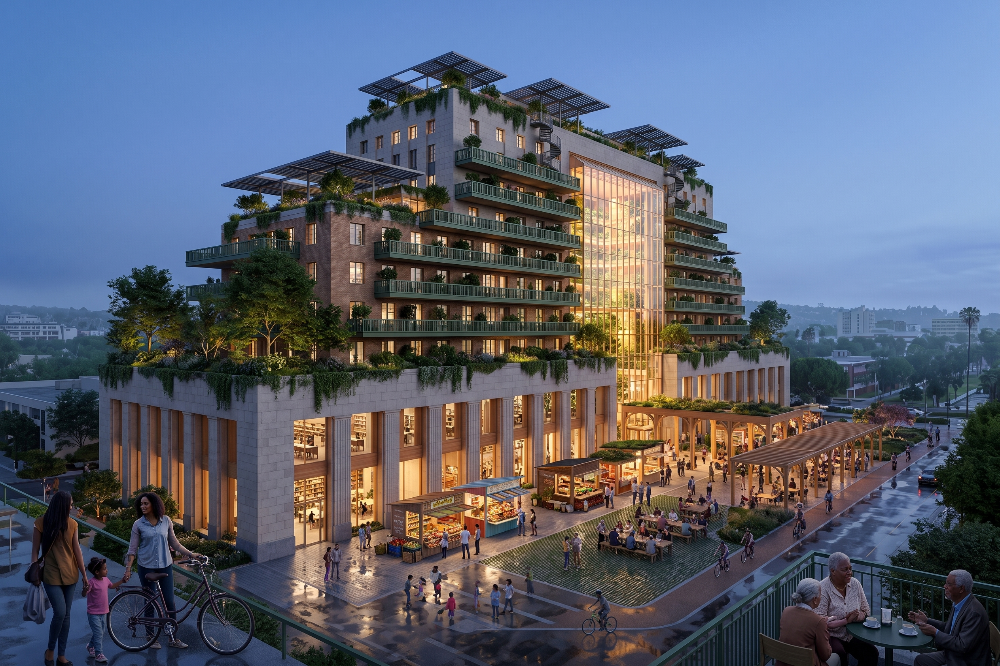
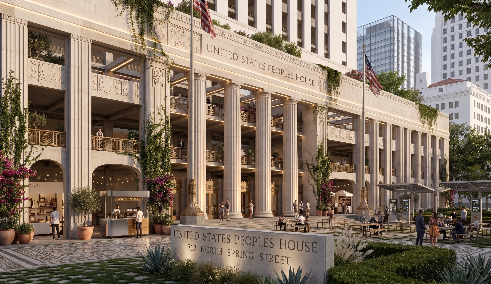

# 🏛️ 312 Spring Commons — PPT-EZ-CA-0001

> ## ⚠️ DRAFT DOCUMENTS — DEMONSTRATION ONLY
>
> Everything on this page and in the linked document library is a **draft**,
> published solely to demonstrate the TitleChain executable-workflow process
> end to end. **Final, execution-ready legal documents will be placed in this
> same location once they exist — they are not here yet.** Nothing currently
> published here is a final legal instrument, an executed agreement, or a
> completed offering document.
>
> **This distinction matters at every step of this pilot, not just at the
> top of this page.** Each document, each status label, and each stage of
> the workflow shown here is part of a process demonstration — treat every
> individual step as draft/demo unless and until it is explicitly
> superseded by a final, counsel-reviewed, executed version in this same
> location.

**People's Public Trust Economic Zone 0001 — California**

A project simulation testing whether an existing federal Historic Surplus pathway can keep public ownership of a major civic asset while mobilizing philanthropic, public, tax-credit, and mission-aligned private capital to rehabilitate and reactivate it — using the same TitleChain agent, registry, chain, credential, authority, title, stewardship, and activation process as [Pilot 001, the People's Trust farm](../peoples-trust/README.md).

> **Current status: Conditional go / diligence.** The federal Historic Surplus pathway remains to be confirmed as available. Public grantee, operator, final project scope, and financing are **not yet approved.** Nothing on this page is an offer to sell or a solicitation to buy any security — and nothing on this page is a final document (see the notice above).

---

## 1. The asset

| | |
|---|---|
| **Property** | Historic Federal Building & U.S. Courthouse, 312 N. Spring Street, Los Angeles, California |
| **Current owner** | United States of America, administered through GSA, subject to authoritative title confirmation |
| **Proposed title outcome** | A qualifying City/County/state instrumentality or other eligible public entity — **TBD** — holding fee title subject to federal historic/public-use restrictions |
| **Working project path** | Historic Monument Public Benefit Conveyance through a qualifying public entity, subject to GSA/NPS confirmation and public approvals |
| **Parcel identifier** | **Unverified.** Working materials reference APN 5161-005-902; a separate external draft referenced APN 5149-010-900. This will not be treated as resolved until authoritative title/survey/assessor evidence reconciles it. |
| **Historic status** | National Register of Historic Places (2006); National Historic Landmark (2012), designated in part for its role in *Mendez v. Westminster* (1946/1947), a forerunner to *Brown v. Board of Education* |

The public keeps the land. Capital finances rehabilitation and a defined operating economy around the asset. Workers and community participate in that economy rather than receiving speculative fractional deed interests.

## Visual references

> ⚠️ **The renderings below are AI-generated concept illustrations, not architectural plans.** They have not been reviewed by GSA, NPS, or any State Historic Preservation Office, and do not represent an approved design. Because this building is a National Historic Landmark, any exterior alteration — additional floors, balconies, glass atria, rooftop structures — would require historic-preservation review and may not be permitted for character-defining features. Treat these as a vision-stage illustration of program potential, not a depiction of what will be built.

### Building Today

**Spring Street Courthouse — Los Angeles, California**

The Spring Street Courthouse is a 17-story Streamline Moderne building completed in 1940, designed by Gilbert Stanley Underwood and Louis A. Simon. It served as the federal courthouse for the Central District of California until 2016 and has since housed Los Angeles Superior Court civil operations and other federal offices. GSA subsequently identified the property for federal disposition.

#### Historical Image Reference

A Getty Images photograph documenting the Spring Street Courthouse has been identified as a useful visual reference for this public research project.

**Image source:** Getty Images

**Copyright:** © 2023 Michael Lee. All rights reserved.

**Use on this page:** Source/reference citation only. The Getty Images photograph is not reproduced or distributed through this repository without an applicable license or other lawful authorization.

The image is referenced here for historical, educational, and research context as part of the TitleChain Foundation Public Commons documentation.

[**View the referenced photograph at Getty Images →**](https://www.gettyimages.com/detail/2168588402)

#### Open-Licensed Image Wanted

We are seeking a current or historical photograph of the Spring Street Courthouse that is:

- U.S. Government/public domain;
- released under a compatible Creative Commons license; or
- contributed by a photographer who authorizes its use in this open public research repository.

Potential sources include National Park Service historic documentation, federal archives, Wikimedia Commons, or an original photograph contributed to the project.

**Public Commons note:** This project distinguishes between source material used for research and content licensed for redistribution. Third-party copyrighted material is not automatically placed under the repository's open-source or open-content license merely because it is cited here.

<strong>Click to view the 3 concept images ↓</strong> — illustrative only, not an approved design

A speculative rendering of the program described above — ground-floor open-air market and civic uses, upper-floor mixed program, rooftop solar and green space — shown here to illustrate the *kind* of activation being tested, not a specific design commitment.

*These are AI-generated illustrations produced for internal visioning. They are not architectural drawings, are not preservation-review-compliant, and do not reflect any approved plan for the property.*

## 2. Why this pilot exists

Pilot 001 (the farm) tested the complete TitleChain process on one private-land use case. This pilot tests the same process on a **public, federally owned, historically designated civic building** — a materially different legal path involving GSA disposal procedures, National Park Service Historic Surplus Property Program oversight, and public-entity conveyance rather than a private land transfer.

The project is simultaneously benchmarking a TitleChain/M5 protocol for title-state transparency, authority controls, and transaction coordination. The protocol does not replace the deed, the recorder, GSA, NPS, or the public owner — it is a parallel evidence and authority layer. **The public deed and applicable government recording system remain legally authoritative.**

## 3. Preliminary capitalization (planning only — not underwritten)

- GSA-reported capital-maintenance liability: **~$153M** — a diligence reference only, not a final budget
- Working capitalization envelope: **~$200M–$240M**, working base case **~$219.6M**
- Potential capital sources include philanthropic/PRI grants, historic tax credits, New Markets Tax Credits, conditional capital commitments, and mission-aligned private capital
- All figures are a planning model and remain subject to independent scope and cost diligence before final underwriting

## 4. Document library

**⚠️ Every document below is a placeholder template published for viewing and workflow demonstration only.** This complete 22-document set (v0.2, September 17, 2026) shows how M5Canon Ricardian contracts can connect human-readable terms, machine-readable policy, accountable executive authority, and executable code without allowing any one layer to silently replace the others. These files are not final or executable instruments, do not authorize a transaction, and are not an offer, commitment, executed agreement, or legal advice. Final documents would require completed facts, authorized parties, applicable approvals, counsel review, signatures, and separately recorded execution state.

### Complete placeholder-template set

The master index and full text of DOC-01 through DOC-22 are available for public process review.

| Doc | Title |
|---|---|
| DOC-01 | Master Deal Term Sheet |
| DOC-02 | Conditional Capital Commitment Letter |
| DOC-03 | Public Grantee MOU |
| DOC-04 | Master Lease Term Sheet |
| DOC-05 | Investor Executive Brief |
| DOC-06 | Capital Escrow and Draw Agreement |
| DOC-07 | Rehabilitation and Development Agreement |
| DOC-08 | Historic Tax Credit Investor Term Sheet |
| DOC-09 | NMTC / CDE Transaction Term Sheet |
| DOC-10 | TitleChain Evidence and Digital Records Schedule |
| DOC-11 | Private Offering / PPM Framework |
| DOC-12 | Subscription Agreement and Investor Questionnaire |
| DOC-13 | Philanthropic Grant and PRI Agreement |
| DOC-14 | Worker and Cooperative Participation Agreement |
| DOC-15 | Master Risk Factors and Disclosure Schedule |
| DOC-16 | M5Canon Master Ricardian and Machine Policy Standard |
| DOC-17 | M5Canon Authority, Jurisdiction and Source-of-Truth Matrix |
| DOC-18 | TitleChain CER, UCC Article 12 and Article 9 Rights Schedule |
| DOC-19 | PPT Federated Registry and Child Collective Governance Agreement |
| DOC-20 | M5-CV W3C Credential, Privacy and Zero-Knowledge Requirements Manifest |
| DOC-21 | M5Canon Project Benchmark and Performance Methodology |
| DOC-22 | M5Canon State-to-Entity Due Process Channel Standard |

**[Browse the full public document set →](./documents/public/)**

### Companion summaries

Short summaries remain available as reading aids for six deal-economics templates. They do not replace or limit access to the complete placeholder documents above.

| Doc | Title |
|---|---|
| DOC-02 | Conditional Capital Commitment Letter |
| DOC-04 | Master Lease Term Sheet |
| DOC-06 | Capital Escrow and Draw Agreement |
| DOC-07 | Rehabilitation and Development Agreement |
| DOC-08 | Historic Tax Credit Investor Term Sheet |
| DOC-09 | NMTC / CDE Transaction Term Sheet |

**[Read the summaries →](./documents/summaries/)**

## 5. Key risks (from the Master Risk Factors and Disclosure Schedule)

- Loss of all invested capital; no guaranteed distribution, yield, redemption, refinancing, or exit
- No private agreement can compel GSA, NPS, a City/County, recorder, permitting authority, or any government body to approve the project
- Governmental timelines may differ materially from programmed efficiency targets
- The GSA capital-maintenance figure and capitalization envelope are planning references, not final underwriting
- Conflicts may exist among sponsor, public owner, tax-credit investors, lenders, and community structures

This is a summary, not the full disclosure schedule. **[Read the complete Master Risk Factors and Disclosure Schedule →](./documents/public/DOC-15-Master-Risk-Factors-and-Disclosure-Schedule.pdf)**

## 6. What this is and isn't

- **Every document in this library is a non-executable placeholder template published only to demonstrate the complete TitleChain and M5Canon Ricardian workflow.** Publication shows how human terms, machine policy, executive authority, and code can be coordinated; it does not execute any document or transaction.
- DOC-11 and DOC-12 demonstrate where private-offering and subscription workflows would fit. Their publication does not constitute an offer to sell or solicitation to buy a security, establish investor eligibility, accept a subscription, or authorize the handling of funds.
- This is a **project simulation and diligence package**, not a completed transaction. Public grantee, operator, final scope, financing, and required government approvals are not yet in place.
- Publication, review, or contact does **not** create an investment, a credential, an account, governance authority, or legal representation.
- "People's Public Trust Economic Zone 0001" is a project benchmark designation, **not** an official state economic-zone designation unless separately authorized.
- SEC Release 34-106246 / File S7-2026-30, referenced in these documents, is a **proposed rule**, not a final compliance standard.

**[Back to all pilots](../README.md) · [TitleChain Foundation](https://titlechainfoundation.org) · [ICSN Standards](https://github.com/TitleChain-Foundation/icsn-standards)**
