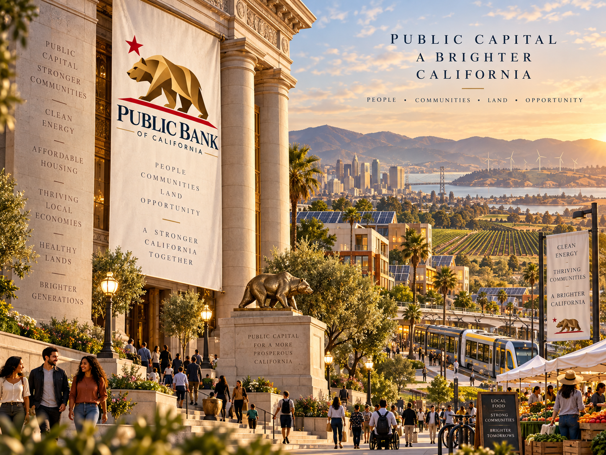

# The Bear Comes Home

*When a place creates wealth, how much of the machinery controlling that wealth should remain within reach of the people who live there?*

> **CONCEPT ONLY.** The Public Bank of California and Spring Commons materials described here are public research and simulation concepts. They do not represent a chartered bank, state agency, depository institution, ownership of the referenced federal property, an investment offering, or a proposed transaction.

There is an old argument in American economic history that we have almost forgotten. It is the argument over who controls the money that builds a place, and whether the wealth created by a community ought to have some reasonable chance of remaining there.

California seems an especially good place to revive that discussion.

This state produces an extraordinary amount of the country’s food, technology, intellectual property and private wealth. It contains farms, ports, universities, businesses, public buildings and land accumulated over generations. Yet the financing of these assets can become increasingly distant from the people who live beside them. The building may be in Los Angeles, the farm may be in the Central Valley and the business may employ Californians, while the debt, ownership and ultimate economic interest can be scattered through institutions far away.

We have come to regard this as inevitable. It is not.

There was a period in American history when states took a much more active interest in the financial machinery beneath their economies. After the Second Bank of the United States lost its federal charter in 1836, a number of states established banks of their own. Most disappeared over time, but the argument behind them never entirely did.

North Dakota revived it under very different circumstances in 1919.

The farmers who organized there were not debating financial theory in the abstract. They were producing wheat and watching too much of the economic power surrounding that wheat accumulate elsewhere. Grain dealers influenced the price of their crops, suppliers influenced the price of what they needed to farm, and distant banks influenced the cost of the credit upon which the whole system depended.

Their answer was political, but it was also remarkably practical: they built institutions.

Among them was the Bank of North Dakota.

More than a century later, that bank remains an unusual American institution because it was not built simply to replace private banking. It became an institution that could work with local financial institutions, participate in lending and direct financial capacity toward the economy of the state itself.

California should not copy North Dakota. The economies are too different and the scale is entirely different. But California might learn something from the question North Dakota asked.

What financial institutions should exist if the purpose is not merely to finance transactions, but to strengthen the productive capacity of a place?

That is the question behind our working concept for a **Public Bank of California**.

For the moment, it is just that — a concept. There is no bank being represented here, no deposit-taking institution and no financial product being offered. What interests me is the architecture and the possibility of testing that architecture against real assets rather than writing another white paper about what might someday be possible.

That experiment has already begun.

Our first public simulation is **Spring Commons — PPT-EZ-CA-0001**, built around the federal courthouse property at **312 N. Spring Street in Los Angeles**. The federal government has identified the property for accelerated disposition. We do not own it, nor are we representing any government agency or proposing that there is already a transaction to be made. We chose it because it gives us something more useful than a hypothetical example: a real building, a real title history, a real jurisdiction and a real public disposition process that can be studied in the open.

We are taking that one property apart, piece by piece.

What is the title? What public money has already gone into the asset? What would happen if it were sold or transferred? Who has authority at each stage? What are the requirements imposed by federal, state and local law? What would redevelopment cost? What forms of financing might lawfully participate? Could a community bank or credit union be involved? Could some form of public banking institution participate alongside private capital? What would stewardship look like after a transfer? And perhaps most important, could the economic value of the property continue circulating through the city in which the property actually stands?

These are not glamorous questions, but they are the questions that determine who ultimately owns things.

Spring Commons is therefore less a proposal for one building than an attempt to construct a repeatable method.

The federal government is reviewing, consolidating and disposing of properties it no longer needs. Every one of those buildings sits somewhere. They occupy city blocks, consume infrastructure and carry histories of public investment. When Washington decides it no longer needs one of them, the building does not vanish. It becomes part of another economy.

That moment should be visible to the public.

Imagine that every city had the ability to identify these properties as they moved toward disposition and place them into a common public index. Add municipal and state properties where appropriate. Over time, add distressed commercial real estate, agricultural land and other assets important to the productive life of the community.

Then document them properly.

Who owns the asset? What is its title history? What jurisdiction governs it? What liens or obligations exist? What public money has already been invested? What is the present condition? What is being proposed? Who has authority to approve a transfer? What happens to the asset five or ten years later?

That would begin to give us something America presently does not have: a public economic map of the physical assets beneath our communities.

The importance of such a map is not simply informational. It changes what people are able to imagine doing.

A city that can see its assets can begin to think about financing them. A community that understands title and authority can organize before an asset disappears into another distant portfolio. Local lenders can see opportunities. Builders can propose uses. Farmers can identify land. Residents can understand what is being sold around them. Public institutions can decide where participation makes sense.

This is where the idea of a public bank becomes interesting to me.

The bank is not the movement. The assets are not the movement. The technology is certainly not the movement.

The movement is the decision to rebuild an economy from the physical and human things upon which an economy actually depends: food, farms, land, water, housing, businesses, infrastructure and the people who produce things.

The financial architecture comes afterward.

For much of the past half-century we have moved steadily in the opposite direction. Assets became securities, securities became increasingly complicated financial instruments, ownership became remote and the relationship between the person living beside an asset and the institution controlling its financing became almost invisible.

Technology could make that distance even greater.

I would rather use it to reverse the process.

Begin with the asset. Establish the title. Establish the human or public authority. Establish the jurisdiction. Preserve the provenance. Then allow financing, technology and markets to sit on top of something that remains understandable.

This is also what I mean when I talk about a more federated American economy.

I am not talking about replacing the United States. I am talking about remembering how it was designed.

The American system begins with distributed authority: communities, cities, counties, states, tribes, territories and a federal government, each with different powers and responsibilities. We have spent decades building economic and technological systems that move in the opposite direction, concentrating enormous amounts of information, capital and decision-making authority inside a relatively small number of institutions.

There is no technological reason that the next system must be built that way.

California can build institutions suited to California. North Dakota can retain institutions suited to North Dakota. Wyoming can build differently again. Cities and tribal nations can operate within their own lawful jurisdictions. They need not become one enormous centralized system in order to work together.

They need common standards, trustworthy records and the ability to transact across boundaries.

That is federation.

The experiment at Spring Street is deliberately small because every large system has to begin somewhere. One building allows us to expose the questions. The questions allow us to develop the process. The process can become an open standard. And an open standard can be picked up by another community and tested against another asset.

If that works, the implications become considerably larger.

There are substantial amounts of public and underused assets sitting inside American cities. Some will remain public. Some will be sold. Some will be redeveloped. Some will simply deteriorate because nobody can put together the capital or authority necessary to do anything useful with them.

The country does not necessarily suffer from an absence of assets. In many places it suffers from an inability to see, organize and finance the assets it already has.

That is the experiment we have opened to the public.

Spring Commons is the first case.

The Public Bank of California is one possible piece of the financial architecture around it.

And the larger question is the one Americans have been asking, in one form or another, for nearly two centuries:

**When a place creates wealth, how much of the machinery controlling that wealth should remain within reach of the people who live there?**

I think it is time we started asking that question again.

---

## Relationship to the Spring Commons repository

This essay is the public narrative companion to the Spring Commons public-bank simulation work. It should be read alongside:

- [v0.7 Public Bank / SEC integration](../update-notes/V0.7-PUBLIC-BANK-SEC-INTEGRATION.md)
- [Spring Commons public deal and transaction documentation](../README.md)
- [Future California concept](../assets/concepts/PPT-EZ-CA-0001-PUBLIC-BANK-OF-CALIFORNIA-FUTURE-CONCEPT-v0.1.png) and [Public Bank logo concept](../assets/concepts/PPT-EZ-CA-0001-PUBLIC-BANK-OF-CALIFORNIA-LOGO-CONCEPT-v0.1.png)

The purpose of this essay is explanatory: to place the simulation in the longer American history of public banking, describe why Spring Commons is being used as the first open case, and explain the broader federated economic thesis without presenting the simulation as an enacted institution or transaction.

## Source notes

- Bank of North Dakota, history and operations: https://bnd.nd.gov/about-bnd/bnd-operations/
- California Department of Financial Protection and Innovation, Public Banks: https://dfpi.ca.gov/regulated-industries/public-banks/
- California State Treasurer, Time Deposit Program: https://website-prod.treasurer.ca.gov/timedeposits-investment
- U.S. General Services Administration, Assets identified for accelerated disposition: https://www.gsa.gov/real-estate/real-property-disposition/assets-identified-for-accelerated-disposition
