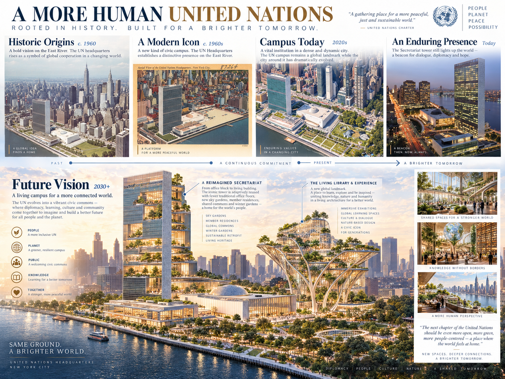
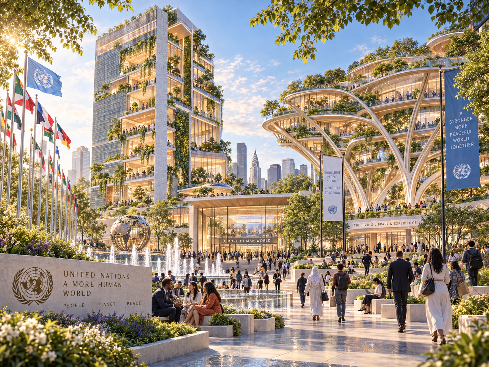
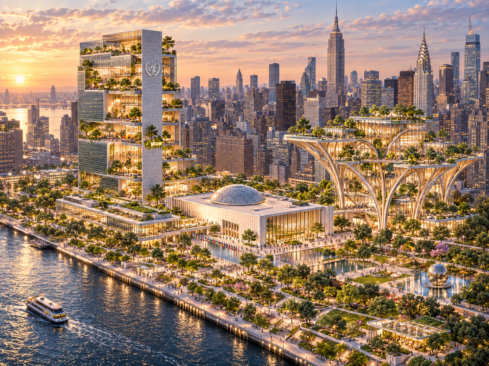
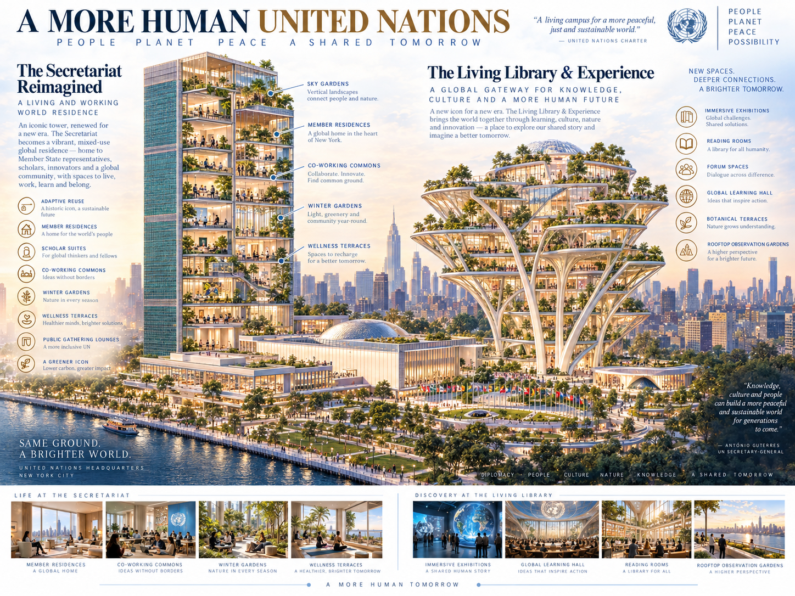

# Global UN Commons — UN-NY-0001

> **Independent public research and concept art only.** This project is not affiliated with, endorsed by, commissioned by, or authorized by the United Nations or any Member State. It is not a UN project, treaty, court, property plan, capital program, transfer-agent appointment, or activation of a government or jurisdiction chain.

The Global UN Commons simulation explores how the approximately 18-acre United Nations Headquarters campus in New York could serve as a public demonstration of human-authorized digital records, peaceful coordination, open standards, and interoperable jurisdiction profiles while preserving the campus's diplomatic function and special legal status.

The four supplied visuals tell a staged concept story. They are not architectural drawings, approved plans, factual depictions of future construction, or evidence of institutional support.

**Concept and design: TitleChain Foundation (2026).** Reuse of the
Foundation-owned concept, design, layout, or original composition must include
the visible credit **“Global UN Commons — concept and design by TitleChain
Foundation”** and link to this repository. No reuse may imply United Nations or
Member State endorsement. See the [visual reuse notice](visuals/README.md).

Institutional reviewers should start with the
[Global UN Commons — Founding Institutional Underwriter Brief](FOUNDING-INSTITUTIONAL-UNDERWRITER-BRIEF.md).

## Transfer-agent and nation-chain demonstration

The proposed Phase 1 demonstration asks whether the same separation tested by Spring Commons and America's People's Trust Farmland can scale across international records:

```text
accountable jurisdiction or institution
→ current authorized human and legal mandate
→ jurisdiction profile and authoritative endpoints
→ bounded transfer-agent or recordkeeping function
→ policy-constrained execution
→ authoritative resulting record
→ portable evidence receipt
```

The initial research target is one interoperable **profile slot for each of the United Nations' 193 Member States**. A slot is not an activated nation chain. Activation requires the relevant jurisdiction's own lawful authority, accountable operator, authoritative endpoints, policies, credentials, revocation, notice, and adjudication routing. TitleChain Foundation, M5, a domain name, registry entry, model, key, wallet, token, or visual cannot activate a state or manufacture sovereign authority.

Physical campus title, securities or structured-debt records, diplomatic authority, nation-chain namespaces, and transfer-agent records remain separate legal and technical domains even when linked by evidence.

## V1 — UN Commons / 18-acre campus masterplan

[](visuals/v1-un-commons-18-acre-masterplan.png)

*Global UN Commons — concept and design by TitleChain Foundation (2026).*

V1 establishes the public-research frame: historic campus, present institutional role, and an imagined civic-commons future. It does not claim a right to redesign, finance, occupy, transfer, or control the campus.

Preliminary public-source title research describes the campus as approximately 18 acres and owned by the United Nations. Formal deed, easement, waterfront, lien, survey, Headquarters Agreement, UN governance, host-country, and capital-authority review would control any real proposal.

## V2 — Open World Forum + Garden of Humanity

[](visuals/v2-open-world-forum-garden-of-humanity.png)

*Global UN Commons — concept and design by TitleChain Foundation (2026).*

V2 imagines public-facing forums, gardens, cultural exchange, learning, evidence, and civic-technology spaces. The names are project concepts, not announced UN facilities or programs.

The Open World Forum would be a proposed public-review environment for differences among evidence, policy, adjudication, authority, and machine execution. The Garden of Humanity would frame ecological restoration and public encounter without implying a construction approval or environmental finding.

## V3 — First New United Nations / Open World Convention

[](visuals/v3-first-new-un-open-world-convention.png)

*Global UN Commons — concept and design by TitleChain Foundation (2026).*

V3 presents the project's convention-stage vision. “First New United Nations” is a creative concept label; it does not propose to replace the United Nations, alter its Charter, redraw borders, confer diplomatic standing, or claim UN adoption.

The **Open World Convention on Digital Records, Human Authority and Peaceful Economic Coordination** remains a proposed public framework—not a treaty. Any adoption would require the lawful processes of participating institutions and sovereign jurisdictions.

## V4 — Pax Commons living tower

[](visuals/v4-pax-commons-living-tower.png)

*Global UN Commons — concept and design by TitleChain Foundation (2026).*

V4 focuses on the Pax Commons living-tower concept: adaptive reuse, member-state and scholar spaces, public forums, learning, gardens, and shared cultural infrastructure. These are visual ideas rather than approved uses, residences, budgets, engineering claims, or entitlements.

“Pax Commons” and “Pax Economica” describe research into peaceful economic coordination. They do not create a fund, financial product, investment right, diplomatic residence, lease, title interest, or regulated market.

## Preliminary title and governance state

| Question | Research state |
| --- | --- |
| Campus identity | Public-source located; formal legal-description and survey verification pending |
| Ownership | UN ownership described by official public sources; complete instrument review pending |
| Conventional mortgage lien | None established by current research; formal title/lien verification pending |
| Development authority | Not established |
| UN authorization or endorsement | None |
| Host-country and city approvals | Not established |
| Nation-chain activation | None; profile architecture only |
| Transfer-agent appointment | None; process demonstration only |
| Authority effect of this simulation | `NONE` |

Any real redevelopment would require the United Nations' governance and budgeting processes, applicable Headquarters Agreement analysis, host-country coordination, professional title and legal review, environmental and planning review, financing authority, procurement, and all other required approvals.

## Project Control Pack

Global UN Commons answers the same eight control questions as every Commons project, in
the same order, using the
[M5 Commons Project Control Pack](../../docs/project-control-pack/M5-COMMONS-PROJECT-CONTROL-PACK-STANDARD.md).

- [Project Control Index and Participant Matrix](PROJECT-CONTROL-INDEX.md)
- [Project Participation Passport and Eligibility Matrix](../../docs/project-control-pack/M5-PROJECT-PARTICIPATION-PASSPORT-AND-ELIGIBILITY-MATRIX.md)
- [M5-CV Work, Opportunity and Support Matching](../../docs/project-control-pack/M5-CV-WORK-OPPORTUNITY-AND-SUPPORT-MATCHING.md)

M5-CV is reusable evidence, not blanket project permission. WORK, SUPPORT and
FINANCIAL PARTICIPATION remain separate pathways, and support never silently
creates ownership, investment, voting or profit rights.

## Public review questions

1. Can a jurisdiction profile expose authoritative endpoints without pretending to be the jurisdiction?
2. Can transfer-agent and recordkeeping functions remain bound to accountable humans, mandates, and systems of record?
3. Can physical title, structured debt, economic rights, and digital representations remain distinct but linked?
4. Can correction, revocation, dispute, and adjudication routing work across jurisdictions?
5. Can public-safe evidence be shared without exposing diplomatic, personal, security-sensitive, or private M5POD records?
6. Can the architecture fail closed when authority, jurisdiction participation, title evidence, or institutional approval is absent?

## Visual provenance

The four TitleChain Foundation concept-and-design images were supplied on September 22, 2026 without embedded author, creator, or copyright metadata. Their exact source hashes, status, attribution requirement, and reuse boundary are recorded in the [visual library](visuals/README.md). Inclusion does not grant rights in the United Nations name, emblem, buildings, or other protected material.

[Back to all project simulations](../README.md)
