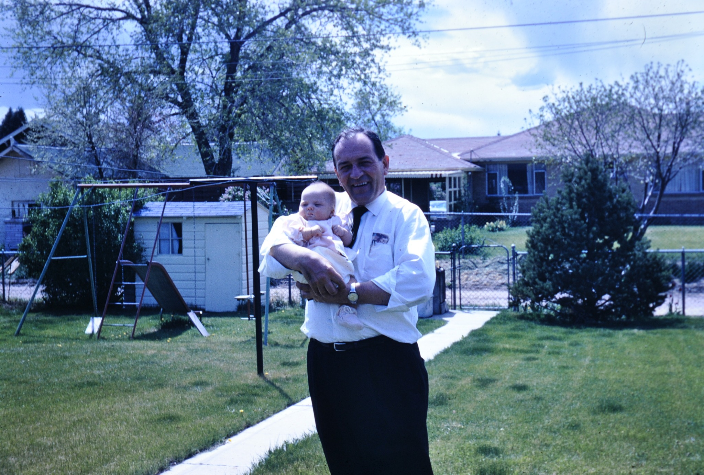

# M5 Sovereign Agriculture — Norton Ranch Blueprint v1.4

**Package date:** October 3, 2026
**Package edition:** Founder Archive
**Status:** Draft implementation package for public review
**Public home:** TitleChain Foundation `M5-AI-Sovereign-Commons`

The **Norton Ranch Blueprint** is the complete package. **Sovereign Herd v1**
is its first bounded reference implementation.

> [!TIP]
> **Get the whole Blueprint in one download.**
> [Download the M5POD starter package](M5POD-PACKAGE.md): documents, schemas,
> examples, data registries and local-only reference code in one verified ZIP
> that runs on your own computer with no network connection.
>
> **Unregistered commons starter:** it is not a licensed M5POD until you
> register, register your farm or ranch entity, and activate the M5 tools.

## Start here

| Need | Open |
| --- | --- |
| **The complete package for your own M5POD** | **[Download and activation guide](M5POD-PACKAGE.md)** · [package manifest](m5pod-package.manifest.json) |
| Free/public data, software and mapping starting points | [Farmer Toolkit](FARMER-TOOLKIT.md) · [machine-readable registry](farmer-data-registry.json) |
| Farmer-controlled livestock monitoring example | [Sovereign Herd](sovereign-herd/README.md) |
| Local-only synthetic provisioning utility | [Reference implementation](../../reference-implementation/sovereign-herd/README.md) |
| Biological stewardship record shape | [Schema](../../schemas/m5-biological-stewardship-record.schema.json) · [synthetic example](../../examples/m5-biological-stewardship-record.example.json) |
| Farmer, OEM, installer and service-provider model | [Business Model](BUSINESS-MODEL.md) |
| Why the public producer commons exists | [Public Purpose](PUBLIC-PURPOSE-AMERICAN-PRODUCER-INNOVATION-COMMONS.md) |

## Download and runtime boundary

Farmers, ranchers, growers and agricultural builders can download the
[Norton Ranch Blueprint M5POD starter package](M5POD-PACKAGE.md), a single
verified ZIP built from this folder. It includes documentation, JSON schemas,
synthetic examples, the machine-readable source registries, the portability
profile, licenses and the local-only Sovereign Herd provisioning utility.

The download is an **unregistered commons starter**. Downloading or running it
does not create an M5 account, a licensed M5POD, a registered entity, a
credential or any authority. It becomes part of a licensed M5POD only after
the principal registers, the farm or ranch entity is registered, and the M5
tools are activated. See the
[activation steps](M5POD-PACKAGE.md#activate-from-starter-package-to-licensed-m5pod).

Every Foundation project is run as a full public simulation with synthetic data
first. The Blueprint shows at ranch scale what the proposed
[Sovereign Compute Access Act](M5POD-PACKAGE.md#why-this-matters-the-sovereign-compute-access-act)
would make possible for everyone: running your own entity with sovereign AI,
local compute and privacy. The Act is model legislation, not enacted law.

This pilot does **not** claim that a packaged M5 Desktop installer is already
available. It is designed to remain compatible with a future local-first M5
Desktop/Freedom Office without making a web publisher, agent framework or
model provider the root of farm authority. Base44 or another public-site
publisher may be an optional adapter. Hermes, Goose, native M5 or future agent
runtimes may be replaceable adapters. Private farm data remains under the
lawful principal's local authority.

## The family story behind the blueprint



**If my grandfather were here today, he would be the first customer I would want to serve.**

Robert Norton began with a small grocery store in downtown Denver and built
Central Packing Co., part of an early group of Colorado meat companies exporting
American beef to Japan in the 1960s. The Norton Ranch Blueprint carries forward
the lessons of that family business: know where the food comes from, make
something good, stand behind it, care for the people and places that make the
business possible, and do not make the customer surrender control in order to
participate.

[Read the founder's dedication →](WHY-THIS-COMMONS-EXISTS.md)

[Historical source note →](CENTRAL-PACKING-HISTORICAL-SOURCE-NOTE.md)

## Stewardship principle

M5 Sovereign Agriculture begins with a simple premise: **we are caretakers before we are owners.**

Land, water, plants, animals and the living systems around us are not merely entries in an asset ledger. Human beings build legal, economic and technical systems around them, but those systems should strengthen our responsibility to protect, care for, restore and pass forward what has been placed in our stewardship.

That includes farms and ranches, forests and soils, oceans and rivers, lakes and wetlands, wildlife habitat, trails and the shared places through which people and other living beings move. Title may establish a lawful right. Stewardship records the responsibility that travels with it.

The M5 architecture therefore distinguishes **control from care**. A registry may show who has authority to act, but the broader purpose is to help human systems become better custodians of the Earth and more accountable caretakers of the living systems and sentient beings that depend on it.

The public commons should make that responsibility easier to fulfill: better provenance, better records, better continuity of care, less waste, fewer extractive data silos and stronger local knowledge — without turning the natural world into a surveillance system or a perpetual subscription.

M5 Sovereign Agriculture applies the M5 human-rooted identity, entity, title, evidence, device, and local-compute architecture to farms and ranches.

The first reference implementation is **Sovereign Herd**: a farmer-controlled cattle monitoring system in which the farmer or ranch entity can register the business, herd, animals, collars, gateways, and evidence relationships while keeping raw operational data and derived herd intelligence in a private local environment.

The design deliberately separates:

1. **The human principal** — M5IAM → TCID/M5HUM.
2. **The legal/business entity** — farm, ranch, cooperative, or operator.
3. **The farm namespace and jurisdiction context.**
4. **The herd and individual animals.**
5. **Hardware devices** — collars, gateways, sensors, local compute.
6. **Private evidence and operational data** — held in the business M5POD/local store.
7. **Public-safe provenance** — only the minimum references necessary for title, device, authority, and conformance.
8. **Public commons** — schemas, reference code, licensed datasets, model methods, and conformance tests.
9. **Commercial services** — hardware, installation, support, analytics, veterinary integration, pasture services, and other lawful value-added services.

## Core rule

**The animal is not the subscription.**

A conforming architecture does not require centralized processing or a recurring per-animal software fee as the condition for a farmer to access the data produced by the farmer's own equipment and herd. Commercial providers remain free to price hardware and services, but data ownership, portability, local operation, and the farmer's authority cannot depend on surrendering custody to a vendor cloud.

## Canonical relationship

```text
M5IAM
  ↓
TCID / M5HUM
  ↓
M5POD — private identity and evidence
  ↓
M5-CV / SOPHIA — authority and capability
  ↓
FARM / RANCH LEGAL ENTITY
  ↓
ENTITY NAMESPACE + JURISDICTION CONTEXT
  ↓
FARM / LOCATION
  ↓
HERD
  ↓
ANIMAL
  ↓
DEVICE ASSIGNMENT
  ↓
LOCAL SENSOR DATA + LOCAL MODELS
  ↓
ALERT / OBSERVATION / FARMER OR VETERINARY REVIEW
```

## Privacy boundary

Public records should never contain minute-by-minute cattle location, raw sensor streams, private farm economics, credentials, private keys, reproductive history, veterinary notes, or other unnecessary operational data.

The public layer may carry a privacy-preserving reference proving that an animal, device, entity, authority relationship, or lifecycle event exists. The underlying operational data remains with the farmer or lawful business principal unless that principal affirmatively authorizes a purpose-limited transfer.

## v1 safety boundary

Sovereign Herd v1 is a **passive monitoring** reference implementation. It covers sensing, local classification, anomaly alerts, provenance, assignment, and portability. It does not implement electrical stimulation, autonomous animal control, veterinary diagnosis, or autonomous treatment.

## Proposed M5 implementation pricing

The open standard does not prescribe price. The proposed M5 commercial implementation is:

- Individual M5 identity: existing individual activation terms.
- M5 Farm/Business Entity: **$840/year proposed base activation**, consistent with a $70/month business entry tier billed annually.
- **$0 per cow per month in required M5 software rent.**
- Hardware, installation, support, storage, specialist analytics, connectivity, and third-party services may be priced separately.

The annual entity activation covers the business namespace, authority context, registry relationships, private operating environment, and the right to use the M5 implementation tools for that registered entity subject to applicable terms.

## Pilot layout

- [`FARMER-TOOLKIT.md`](FARMER-TOOLKIT.md) — farmer-facing free/public data,
  software and implementation starting points.
- [`farmer-data-registry.json`](farmer-data-registry.json) — machine-readable
  access, rights-state and implementation cautions for every toolkit source.
- [`sovereign-herd/`](sovereign-herd/README.md) — public livestock pilot,
  source registry, schemas and synthetic examples.
- [`reference-implementation/sovereign-herd/`](../../reference-implementation/sovereign-herd/README.md)
  — local-only synthetic provisioning utility.
- [`BUSINESS-MODEL.md`](BUSINESS-MODEL.md) — farmer, OEM, installer and
  service-provider model.
- [`SOURCE-RESEARCH.md`](SOURCE-RESEARCH.md) — detailed livestock research
  starting points and licensing cautions.

## Non-claims

This package does not claim that:
- a government has recognized an M5 registration as legal incorporation;
- every dataset listed is redistributable;
- any model is veterinary-grade;
- any collar vendor is M5 certified;
- any farmer, ranch, animal, or device is live on the system;
- the pilot is production-ready.

Government formation, livestock identification, movement, animal welfare, veterinary, food, radio, privacy, contract, and other applicable rules remain external authoritative requirements.

## v1.1 — Farmland integration

This package now connects Sovereign Herd to the existing People's Trust Farmland pilot through a broader **Biological Stewardship Registry**. Sovereign Herd is Reference Implementation 001; later implementations may cover crop cycles, seed/harvest lots, orchard blocks, hives/colonies and other managed biological systems at the appropriate granularity.

## The American Producer Innovation Commons

This repository exists to lower the cost of innovation for farmers, ranchers, growers, producers, cooperatives, family businesses and independent entrepreneurs.

It is dedicated to the Americans who have spent generations caring for land, animals, crops, water and local food systems — often while consolidation, technology lock-in and rising costs made independent operation harder.

The family story behind the work is the [Norton Ranch dedication](WHY-THIS-COMMONS-EXISTS.md). The reusable architecture is the **Norton Ranch Blueprint**: a public starting point meant to help other people build businesses of their own, not another platform meant to own them.

See also the
[Public Purpose](PUBLIC-PURPOSE-AMERICAN-PRODUCER-INNOVATION-COMMONS.md), the
[Farmer Toolkit](FARMER-TOOLKIT.md), and the
[Halter case study](sovereign-herd/CASE-STUDY-HALTER-AND-THE-FARMER-OWNED-ALTERNATIVE.md).
