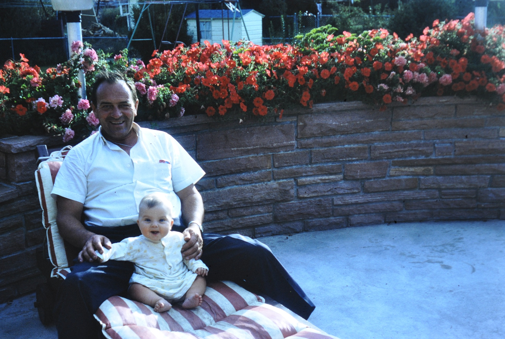

# For My Grandfather, Robert Norton

*Pamela Norton with her grandfather, Robert Norton. Family archive photograph.*

This is me with my grandfather, Robert Norton.

Long before I knew anything about technology, patents, artificial intelligence or blockchains, I knew what it looked like to build a business from the ground up.

My grandfather started with a small grocery store in downtown Denver and built **Central Packing Co.** from there. He cared about the quality of the meat, how it was cut, how it was packaged and how it reached the customer. He developed his own methods around cutting, packaging and preservation, and Central Packing Co. was among the early group of Colorado meat companies exporting American beef to Japan in the 1960s.

But what stayed with me was not simply what he built. It was how he thought about business.

You knew your suppliers. You knew the people who worked for you. You knew where the food came from. You made something good. You stood behind it. And the community that supported your business mattered.

*Robert Norton and Pamela Norton. Family archive photograph.*

I look at what has happened to American farming, ranching, food production and small business since then and often wonder what he would think of it.

I know he would understand immediately why I am building this.

**If he were here today, he would be the first customer I would want to serve.**

My hope is that in my lifetime I can buy a piece of land and call it **Norton Ranch LLC** — not as some enormous corporate agricultural operation, but as a working example of what we are building here: land cared for rather than extracted from, animals treated humanely, food produced with integrity, technology owned by the people using it, and the knowledge created on that land kept in the hands of the people responsible for it.

And then I want to help other people do the same.

The rancher with 40 cows should have access to the same modern intelligence as the company with 40,000. The beekeeper should be able to build around her hives. The flower grower around her soil and varieties. The orchard family around its trees. The potato farmer around a field and crop cycle that may have been tended by the same family for generations.

They should not have to surrender their data, their history or a piece of every animal they raise simply to participate in the next generation of technology.

That is why I call this the **Norton Ranch Blueprint**.

It is named for my family, but it is not meant to belong to my family.

**Norton Ranch is the family story behind why I want to give the blueprint away.**

The purpose of this Commons is to give every farmer, rancher, grower, producer, family business and independent entrepreneur a better starting point: open standards, public research, local-first software, provenance, portable records and the tools to build businesses of their own without making a distant platform the permanent owner of their operating history.

Maybe one day Norton Ranch LLC will become real.

Until then, this is where it begins.
