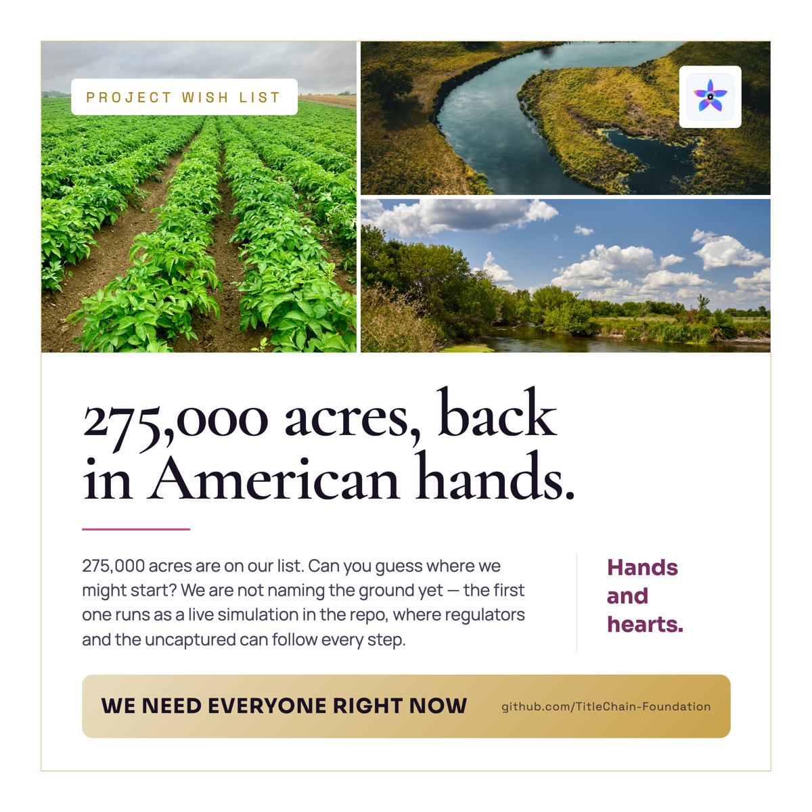

# People's Trust Farmland — Capital & Operating Partner Brief

> **Public simulation and review brief only.** This brief is not an offering,
> investment recommendation, farm acquisition announcement, ownership claim,
> credential, membership admission, operating contract, or financing commitment.

The People's Trust Farmland simulation tests how farmland stewardship, local
operations, title evidence, participant authority, project economics, correction,
and portable records can remain separate and verifiable before any consequential
action executes.

## Visual entry point

Additional public visuals: [authority before execution](visuals/authority-before-execution.svg),
[repeatable pipeline](visuals/repeatable-pipeline.svg),
[four-rights separation](visuals/four-rights.svg), and the
[full project visual story](README.md#the-project-vision).

## What partner review should test

- whether title, operator authority, stewardship obligations, and any economic
  instrument remain distinct;
- what evidence a capital partner, grower/operator, fiduciary, title reviewer,
  or public-benefit steward would require;
- how local operating authority is bounded by role, scope, budget, policy,
  revocation, and public-safe evidence;
- how corrections, disputes, successor transfers, and project exits would remain
  attributable and portable;
- how participation can avoid silently creating title, membership, voting,
  securities, farm-output, or economic rights.

## From property diligence to operating-system diligence

The pilot also asks partners to look below the land record.

A working farm includes living systems that are raised, grown and cared for on
the property. The draft
[Biological Stewardship Registry](BIOLOGICAL-STEWARDSHIP-REGISTRY.md) tests how
those records can remain distinct from title while preserving provenance,
operator authority, care and production evidence, device history, and
portability.

The first reference implementation is
[Sovereign Herd](../norton-ranch-blueprint/sovereign-herd/README.md), a cattle
example in which the animal record persists even when a collar or technology
provider changes, while raw telemetry and derived herd intelligence remain
private unless the lawful principal authorizes disclosure.

Partner diligence should therefore ask not only, "Who controls the land?" but
also, "Who controls the operating history and intelligence produced by the
living systems on it, and can that history move with the farm rather than the
software vendor?"

## Review question

> **What would you need to see, change, or diligence before capital, operations,
> stewardship, or evidence could move?**

## Route

Reply/DM: **FARM**

Start with the [People's Trust project simulation](README.md), then review the
[authority-before-execution visual](visuals/authority-before-execution.svg),
[repeatable pipeline](visuals/repeatable-pipeline.svg), and
[M5-CV Activation Bridge](ACTIVATION-BRIDGE.md).
