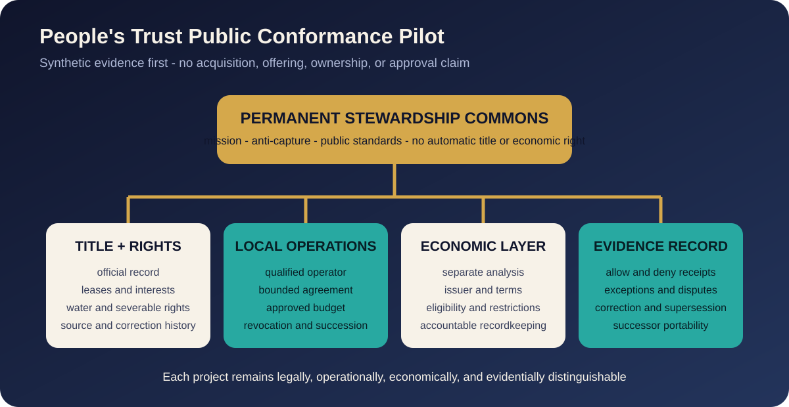

# People's Trust Public Pilot Library

## What this is

This is the visual front door for the proposed People's Trust Public
Conformance Pilot. The pilot asks whether title, identity, entity, authority,
operations, stewardship, economic rights, restrictions, recordkeeping,
correction, and portability can remain separate and verifiable before a
consequential action executes.

The public pilot begins with synthetic evidence. It is not an acquisition,
offering, ownership claim, live deployment, regulator-approved program, or
announcement that a private party has agreed to participate.

## The pilot in one view

| Layer | What the pilot must prove |
| --- | --- |
| Official title and rights | Linked evidence does not replace the authoritative public record |
| Entity and signer authority | A current accountable person or entity is established before capability |
| Local operations | Operational authority is bounded by role, scope, budget, and revocation |
| Stewardship | Mission participation does not silently create title or economic rights |
| Economic instrument, if any | Classification, issuer, eligibility, restrictions, and accountable recordkeeping remain explicit |
| Evidence and correction | Allow, deny, exception, correction, supersession, and successor transfer are inspectable |

## Public pipeline without private targets

The pilot uses public scenario codes such as `AG-PILOT-001`,
`FW-PILOT-002`, and `COMMUNITY-006+`. The label `████████` is a fixed design
device meaning that public evidence and announcement gates have not passed. It
does not conceal a recoverable name or confirm that a transaction exists.

Do not use comments, images, metadata, filenames, maps, or guesses to identify
a nonpublic property, owner, operator, counterparty, location, valuation, or
transaction.

## What to review

1. [Read the maintained pilot specification](../../docs/PEOPLES-TRUST-PUBLIC-PILOT.md).
2. [Review the SEC and regulator question crosswalk](../../docs/PILOT-SEC-RFI-CROSSWALK.md).
3. [Join People's Trust Discussion #1](https://github.com/TitleChain-Foundation/M5-AI-Sovereign-Commons/discussions/1).
4. Challenge one authority assumption, failure condition, privacy boundary,
   evidence requirement, or conformance test.
5. Do not post confidential evidence or vulnerability details publicly.

## Visual provenance

The diagrams in this Library were created for this repository from the reviewed
public pilot text. Earlier private carousel drafts were not published because
they included unverified or high-risk claims involving acreage, ownership,
pricing, funding, governance, benefits, live-project status, and target
speculation. Photography from those drafts also requires separate rights,
location, and metadata review.

Visuals are illustrative public-review aids. The maintained pilot specification
controls where a visual summary differs.
