# People's Trust Project Simulation

## What this is

This is the visual front door for the People's Trust project simulation. It
follows one real-world farm use case through the complete TitleChain agent,
registry, chain, credential, authority, title, stewardship, and activation
process using sample, non-production records.

People who want to understand how the public waitlist and M5-CV capability
pathway connect to this simulation should start with the
[M5-CV Activation Bridge](ACTIVATION-BRIDGE.md).

Capital and operating partners should start with the
[People's Trust Farmland — Capital & Operating Partner Brief](CAPITAL-AND-OPERATING-PARTNER-BRIEF.md).

The simulation is designed to be inspected in public before a dollar moves or a
consequential action executes. It asks whether title, identity, entity,
authority, operations, stewardship, economic rights, restrictions,
recordkeeping, correction, and portability can remain separate and verifiable.

## How to read the visual story

The seven cards describe the project vision. They are not a contract, current
ownership record, live transaction, securities offering, or promise of a legal
or economic right. These current boundaries control where a card uses campaign
shorthand:

- **275,000 acres** is the target pipeline and project wish list. It is not a
  claim that the Foundation or the People's Trust owns, controls, has under
  contract, or is offering those acres.
- **13.5 million owners** describes the long-term national participation vision,
  not a count of current owners, members, investors, or account holders.
- **Running live in the repo** means the sample-data workflow and its evidence
  can be reviewed as the simulation operates. No live title, ownership, money,
  property transfer, investment, or securities offer is created.
- **$10** is the one-time Founding Steward campaign contribution. It supports
  the People's Trust campaign and begins the IAM and M5-CV pathway after the
  activation profile and required consents are completed. It is not currently
  DUNA legal membership, an equal vote, a credential, or an M5POD.
- A future credentialed, member-controlled **M5POD is a separate $49-per-year
  activation**. Current service terms and pricing are controlled by M5Bank.
- Any cooperative participation, voting, funding, farm output, title,
  stewardship, or economic right requires its own adopted legal structure,
  eligibility, affirmative consent, authority, disclosures, and recorded
  admission. A visual card does not create those rights.

## The project vision

### 1. One farm, a national participation vision

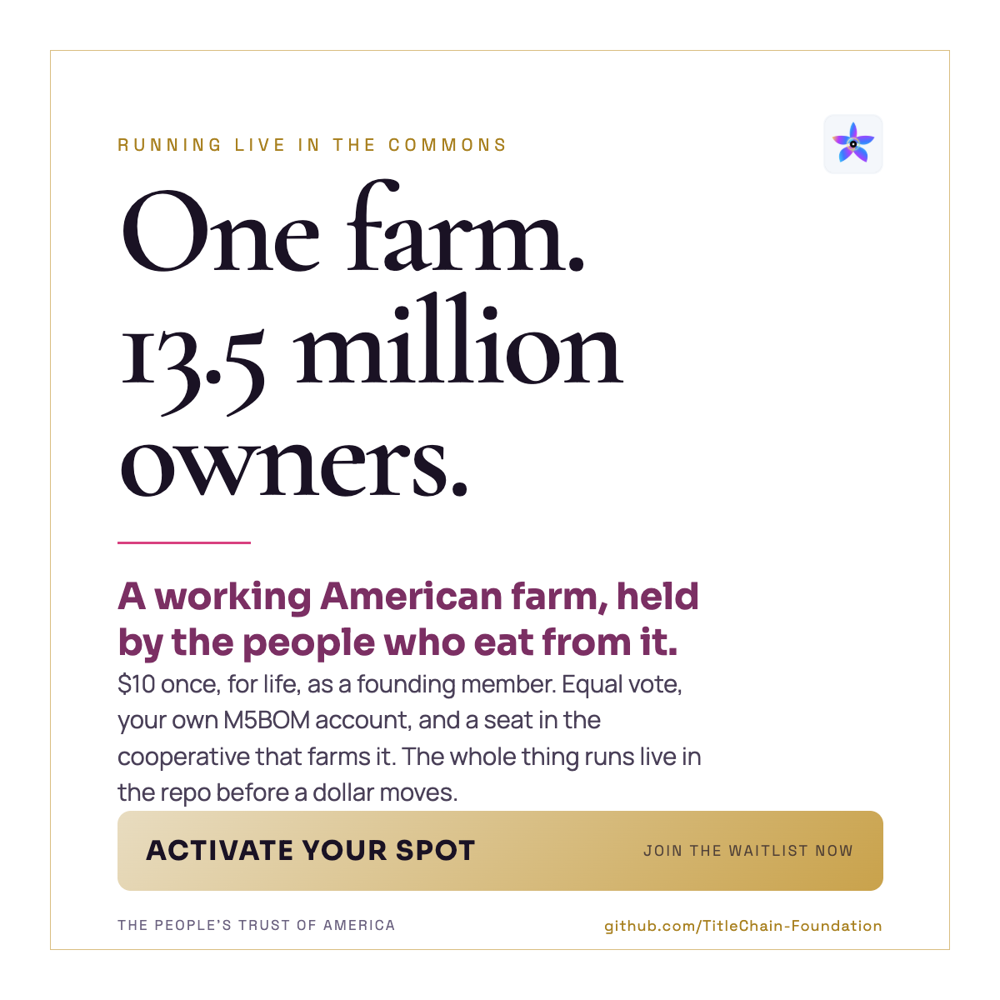

The farm is the real-world use case; the records used in this public
demonstration are sample and non-production. The 13.5 million figure expresses
the scale of the participation vision, not a current ownership count.

### 2. One trust, independently bounded projects

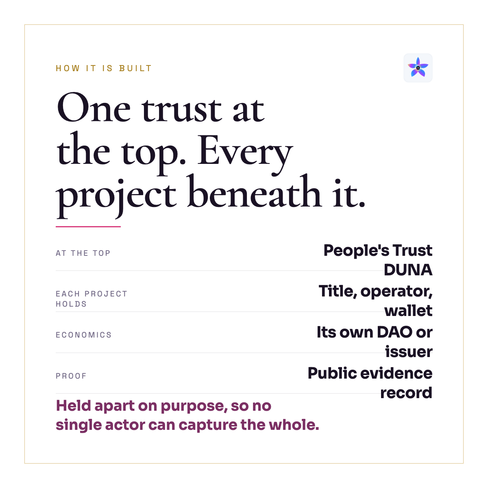

The architecture is intended to keep each project's title, operator, wallet,
economics, issuer, and evidence distinct. The People's Trust DUNA is planned;
the name on this vision card does not represent completed formation or current
legal membership.

### 3. The service ladder

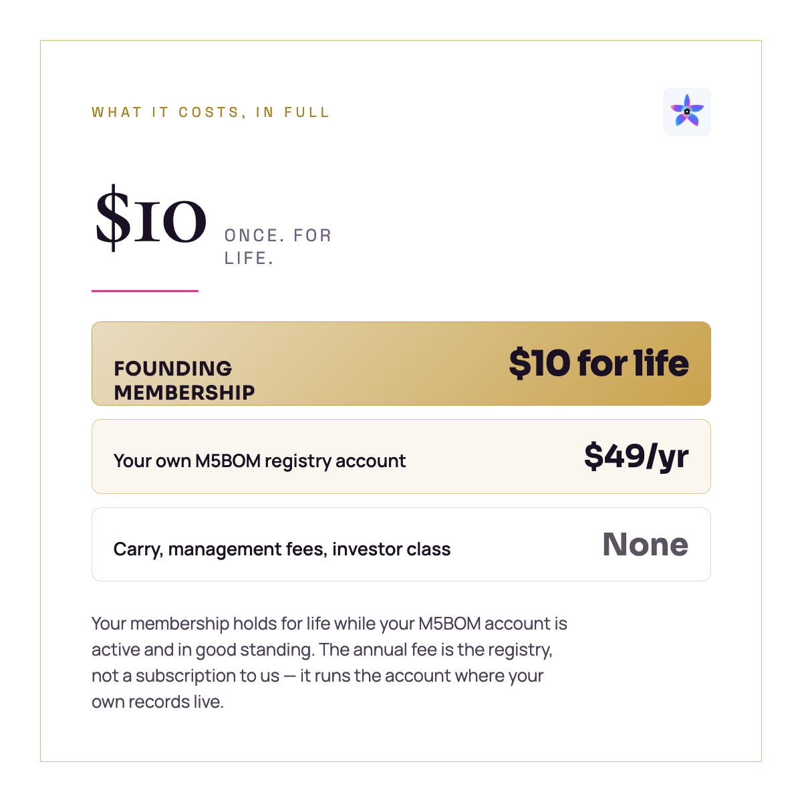

The current public pathway is: **$10 Founding Steward campaign contribution →
included IAM starting point and beginning M5-CV → future credentialed M5POD at
$49 per year**. The $10 is not a lifetime legal membership, and the $49 service
is a credentialed M5POD rather than the sale of identity or a credential.

### 4. Steward participation

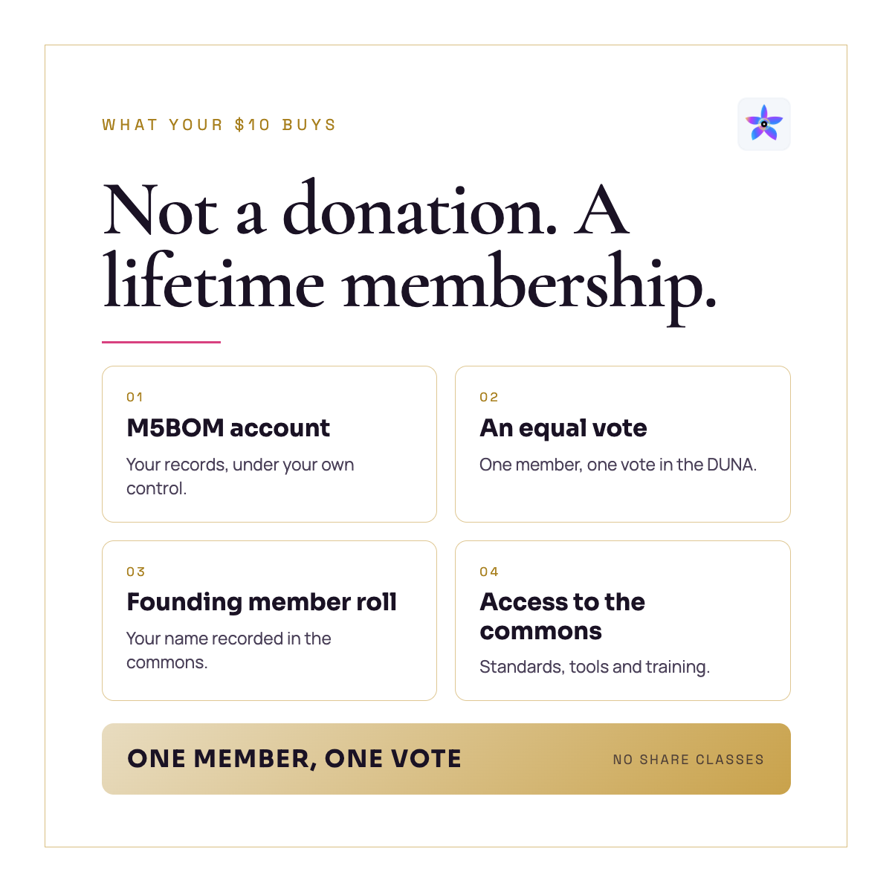

The intended governance principle is broad, human-led participation without
investor share classes. Current Founding Steward campaign status does not yet
create DUNA legal membership or voting rights. Those rights require formation,
adopted governing principles, eligibility, affirmative consent, and admission.

### 5. Growers, communities, and transparent stewardship

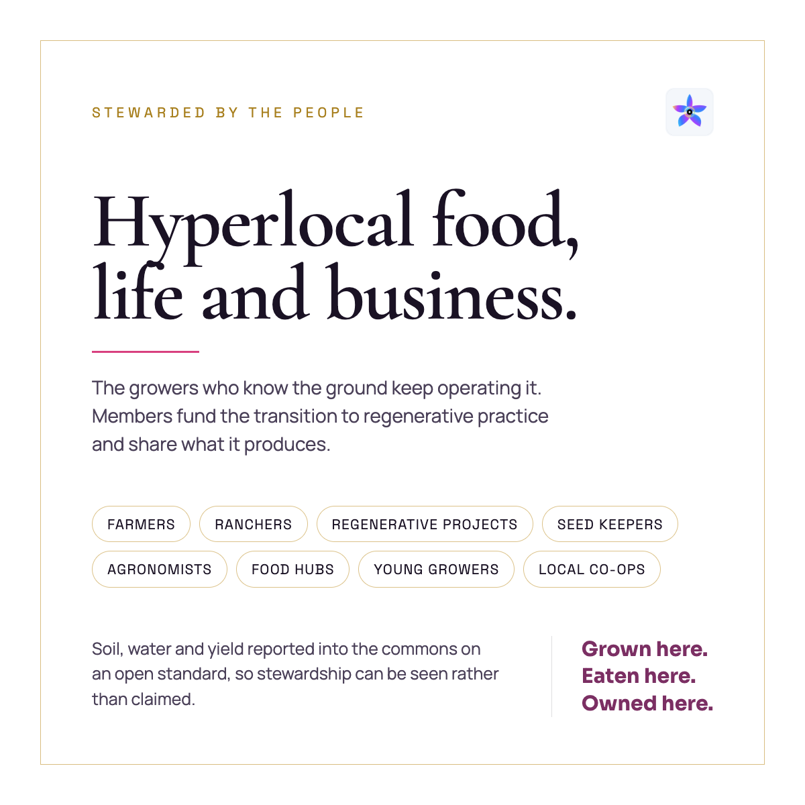

The simulation tests how growers can retain bounded operating authority while
stewardship evidence is visible and independently reviewable. Funding,
cooperative participation, and any right to farm output must be defined in a
separate approved instrument; they are not created by joining the campaign.

### 6. A path into the simulation

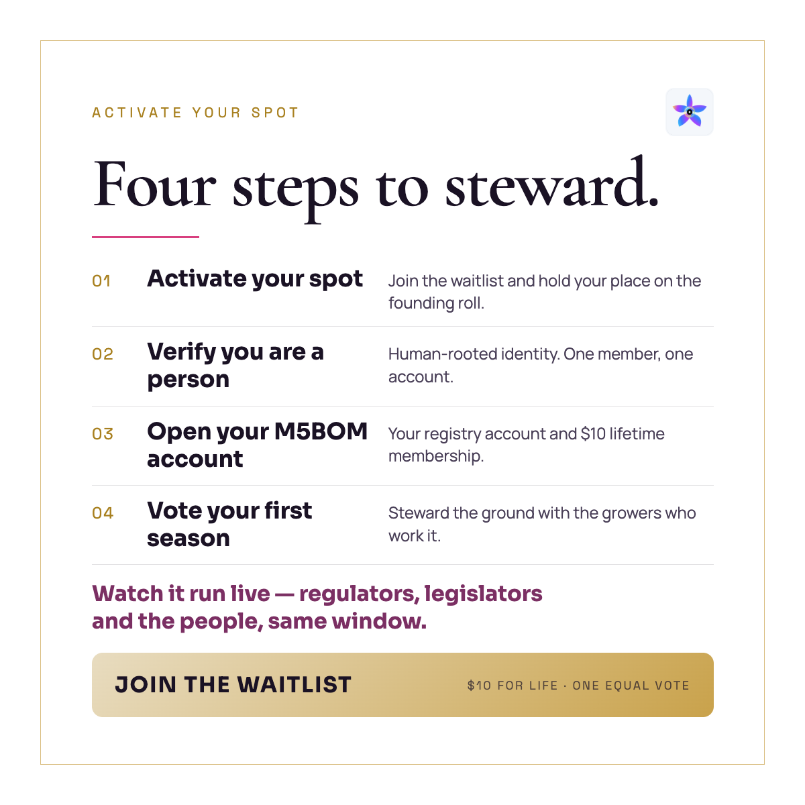

The current first step is to become a Founding Steward and then complete the
activation profile and required consents. The simulation itself issues no
credential, opens no production M5POD, admits no DUNA member, and creates no
vote. Public review of the standards and simulation remains free.

## The pilot in one view

| Layer | What the pilot must prove |
| --- | --- |
| Official title and rights | Linked evidence does not replace the authoritative public record |
| Entity and signer authority | A current accountable person or entity is established before capability |
| Local operations | Operational authority is bounded by role, scope, budget, and revocation |
| Stewardship | Mission participation does not silently create title or economic rights |
| Economic instrument, if any | Classification, issuer, eligibility, restrictions, and accountable recordkeeping remain explicit |
| Evidence and correction | Allow, deny, exception, correction, supersession, and successor transfer are inspectable |

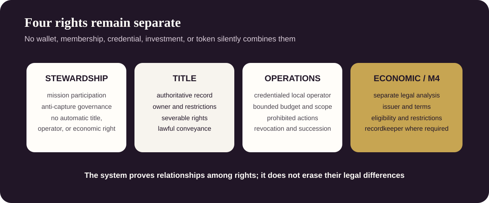

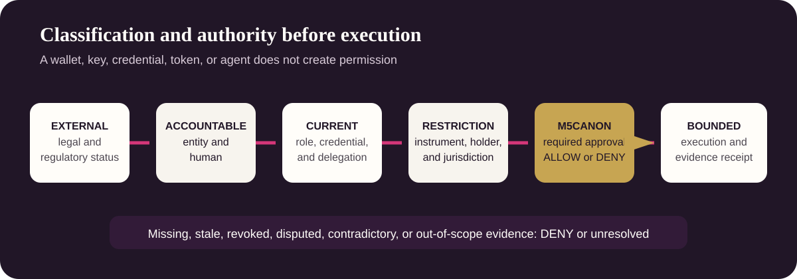

## Pilot Project Pipeline

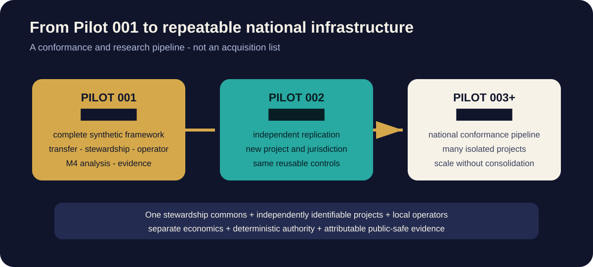

This simulation is not intended as a one-off example. It is the first
sample-data conformance instance in a proposed repeatable national framework
for:

- authoritative title and rights transfer;
- permanent public-benefit stewardship without centralized asset ownership;
- credential-bound local operating authority;
- separate project accounts and economics;
- separately analyzed M4 economic-right representation, if any;
- regulated recordkeeping where applicable;
- correction, succession, portability, and public-safe evidence.

| Sequence | Public label | What it tests | Public state |
| --- | --- | --- | --- |
| Pilot 001 | `████████ AGRICULTURAL PILOT` | Whether the complete transfer, stewardship, operations, authority, M4, and evidence architecture can be simulated end to end | `SAMPLE-DATA SIMULATION` |
| Pilot 002 | `████████ REPLICATION PILOT` | Whether the same controls can be reused for a second independently bounded project and jurisdiction | `PROPOSED` |
| Pilot 003+ | `████████ NATIONAL PIPELINE` | Whether the framework can scale across agricultural, food, water, local-enterprise, and community-asset scenarios without collapsing them into one owner, treasury, or authority graph | `PROPOSED` |

The Foundation has accumulated private research concerning multiple asset,
title, rights, operator, and jurisdiction scenarios over several years. That
research supports the need for a repeatable test framework; it does **not**
establish that any asset is available, owned, controlled, under contract,
currently offered, approved, valued, financed, or ready for activation.

The pipeline is therefore published as a **conformance and research pipeline**,
not as an acquisition list. A scenario advances only when its exact evidence,
claim state, accountable authority, privacy boundary, and applicable legal
review support the stated phase.

## Public pipeline without private targets

The pilot uses public scenario codes such as `AG-PILOT-001`,
`FW-PILOT-002`, and `COMMUNITY-006+`. The label `████████` is a fixed design
device meaning that public evidence and announcement gates have not passed. It
does not conceal a recoverable name or confirm that a transaction exists.

Do not use comments, images, metadata, filenames, maps, or guesses to identify
a nonpublic property, owner, operator, counterparty, location, valuation, or
transaction.

## Technical review

### Conformance review sequence

**5. Ten advancement gates**

[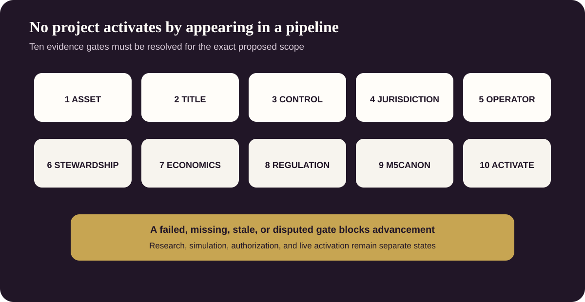](visuals/ten-gates.svg)

**6. Evidence and claim states**

[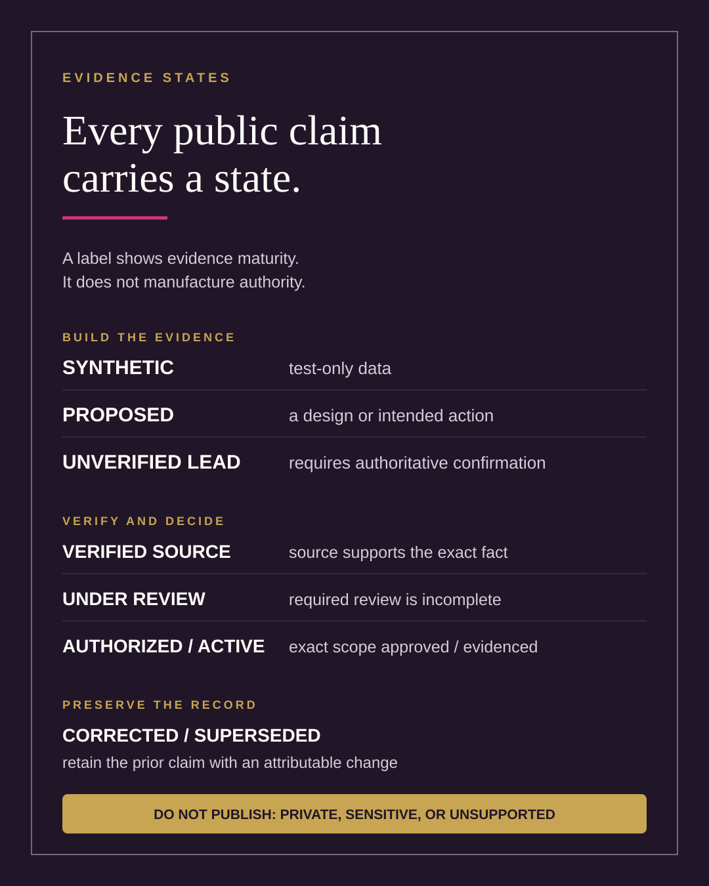](visuals/evidence-states.svg)

**7. Conformance and failure testing**

[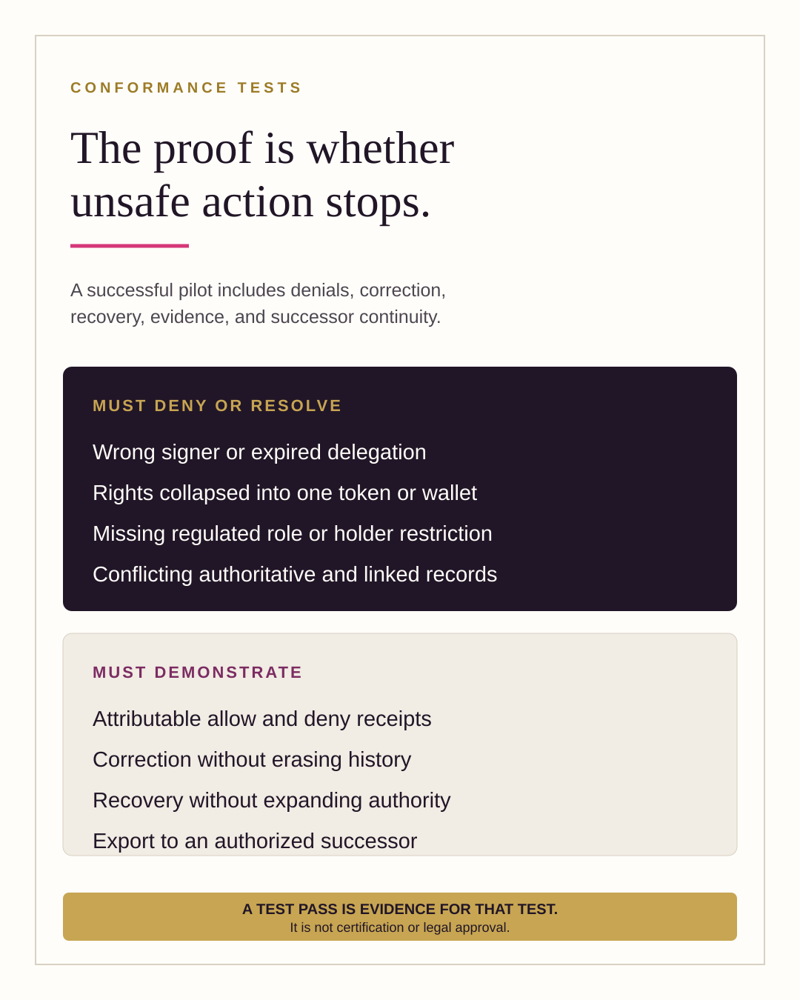](visuals/conformance-tests.svg)

**8. Seats at the table**

**9. Join the public review**

[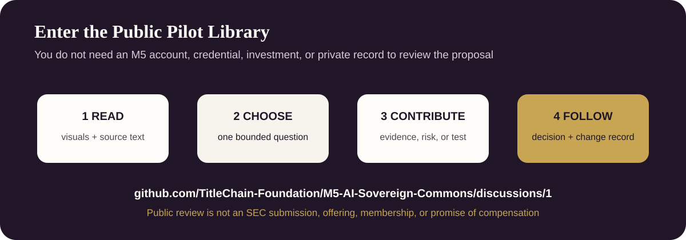](https://github.com/TitleChain-Foundation/M5-AI-Sovereign-Commons/discussions/1)

1. [Read the maintained pilot specification](../../docs/PEOPLES-TRUST-PUBLIC-PILOT.md).
2. [Review the SEC and regulator question crosswalk](../../docs/PILOT-SEC-RFI-CROSSWALK.md).
3. [Join People's Trust Discussion #1](https://github.com/TitleChain-Foundation/M5-AI-Sovereign-Commons/discussions/1).
4. Challenge one authority assumption, failure condition, privacy boundary,
   evidence requirement, or conformance test.
5. Do not post confidential evidence or vulnerability details publicly.

## Visual provenance

The seven project-vision cards are the approved visual story supplied for this
Library. The written explanations beside them distinguish the vision from
current campaign terms, service status, legal rights, and operational facts.
The maintained pilot specification and attributable governance records control
where visual shorthand differs.
