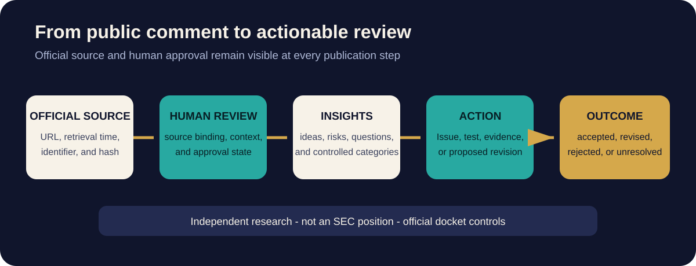

# SEC Public Input Summary



**Docket:** SEC File No. S7-2026-30, Transfer Agent Rules

**Summary state:** Human-reviewed public-interest research

**Source snapshot:** September 16, 2026 at 17:11 UTC

**Official comments visible in that snapshot:** 14

**Human-reviewed summaries:** 1

**Pending local human review:** 13

This page is a dated orientation to public input, not an SEC publication,
position, endorsement, or substitute for the official docket. The
[official SEC docket](https://www.sec.gov/rules-regulations/public-comments/s7-2026-30)
controls and may have changed since this snapshot.

## Live automated observatory

The [SEC Public Comment Observatory](https://titlechain-foundation.github.io/M5-AI-Sovereign-Commons/sec-observatory/)
checks the official docket every hour. It publishes the exact SEC docket
metadata, official filing URL, retrieval time, media type, and source SHA-256
for each listed filing.

Automated topic signals are labeled **not human reviewed**. Narrative summaries
appear only after an attributable review record is checked against the
collected filing and approved.

## TitleChain Foundation filing is now posted

The SEC docket now lists the Foundation's September 5 public comment from
Pamela Norton, Founder and Executive Director of TitleChain Foundation and
Sovereign Chief Architect of TitleChain Registry.

[Read the official TitleChain Foundation filing](https://www.sec.gov/comments/S7-2026-30/s7202630-1029659-3393926.pdf).

The filing asks the Commission to consider voluntary, implementation-neutral
open standards for interoperable transfer-agent infrastructure while preserving
each regulated entity's responsibility for its legally authoritative records.
It addresses credential-bound authority, machine-readable restrictions,
pre-execution controls for automated agents, separation of origination and
transfer authority, preservation of the underlying right, and portable
correction and successor-transfer evidence.

This description identifies the Foundation's submitted position. It is not an
SEC endorsement, adopted standard, or representation that any TitleChain or M5
component is registered, mandated, certified, or deployed for regulated use.

## People's Public Trust — Open Commons Review

The latest weekly review finds that modernization needs an accountable operator,
explicit records of authority, continuous reconciliation, governed correction,
and portable successor evidence. It also identifies a need to preserve what a
security represents, which source supports each material fact, which record
controls each legal object, and what changed under whose authority.

[Read the September 9–15 Open Commons Review](open-commons-review/2026-09-15.md).
The [September 1–8 inaugural review](open-commons-review/2026-09-08.md) remains
available as its dated record.

The weekly orientation is approved for public review. It does not change the
source-level observatory count below: one detailed comment summary is approved
and thirteen remain pending detailed human review.

## What the currently reviewed third-party input says

The reviewed comment asks the Commission to distinguish the legal and
operational roles a distributed ledger may perform in a securities-record
architecture. It calls for technology-neutral resilience properties, explicit
accountability for protocol selection and operation, and continuity when an
accountable transfer agent changes.

[Read Zayn's September 1 public comment on the official SEC docket](https://www.sec.gov/comments/S7-2026-30/s7202630-1025059-3321906.html).
This summary is an interpretation prepared for public review, not the
commenter's full submission.

The other twelve third-party comments are indexed in the observatory and
remain pending human review. Their presence and frequency do not represent a
vote, consensus, or SEC position.

## Emerging ideas

- Distinguish a token whose authoritative record is elsewhere from a ledger
  that participates in or constitutes a proposed authoritative ownership
  record.
- Evaluate consensus control, finality, transaction ordering, availability,
  sponsor dependence, governance, and long-term persistence.
- Define protocol-resilience properties rather than relying only on a static
  list of approved technologies.
- Allow the accountable transfer agent to change without losing authoritative
  history or creating competing master records.
- Scale controls to the legal and operational role the ledger performs.

## Risks and unanswered questions

- A chain event may be mistaken for legally authoritative ownership state.
- Concentrated sequencing, validation, administration, upgrade, or governance
  power may create legally material control.
- A record may become unavailable if a network sponsor or critical operator
  disappears.
- Transfer-agent succession may create conflicting records without explicit
  reconciliation and continuity controls.
- Technical immutability may conflict with legally required correction,
  restriction, or court-ordered action.

## Proposed conformance work

1. Test chain reorganization after a purported legally effective transfer.
2. Test validator, sequencer, administrator, governance, and
   transaction-ordering capture.
3. Test transfer-agent replacement without loss of history or creation of
   competing masters.
4. Represent corrections and court orders without treating technical
   immutability as the sole source of legal effect.
5. Define technology-neutral resilience properties tied to the role performed.

## Pilot Project Pipeline

The People's Trust simulation is Pilot 001 of a proposed repeatable national
framework, not a single illustrative transaction. It is designed to test a
common control pattern across independently bounded projects:

```text
Pilot 001 - complete synthetic framework
    -> Pilot 002 - independent replication
    -> Pilot 003+ - national scale and anti-consolidation tests
```

The repeated pattern keeps authoritative title, stewardship, local operations,
project economics, any separately analyzed M4 economic right, regulated
recordkeeping, and correction evidence distinct. This gives regulators, state
agencies, transfer agents, title professionals, operators, and standards
reviewers more than one scenario against which to test portability,
jurisdictional variation, successor continuity, and failure handling.

The broader pipeline reflects years of private research but is published only
as anonymous conformance categories. It is not an asset inventory, acquisition
announcement, offering pipeline, or evidence that any owner, seller, operator,
regulator, transfer agent, or agency has agreed to participate.

[Open the claims-safe visual Pilot Project Pipeline](../pilots/peoples-trust/#pilot-project-pipeline).

## Where this work is tracked

| Public workspace | Purpose |
| --- | --- |
| [SEC Project #2](https://github.com/orgs/TitleChain-Foundation/projects/2/views/2) | Seven scoped review topics and their status |
| [ICSN Issue #56](https://github.com/TitleChain-Foundation/icsn-standards/issues/56) | Transfer-agent interoperability |
| [ICSN Issue #62](https://github.com/TitleChain-Foundation/icsn-standards/issues/62) | Reference state model for the underlying right |
| [Pilot and SEC RFI Crosswalk](../docs/PILOT-SEC-RFI-CROSSWALK.md) | How the synthetic pilot can test public-review themes |

GitHub comments support independent Foundation review. They are not submitted
to the SEC. Use the SEC's official channel for a comment intended for the
Commission.

## Review and publication controls

Future summaries should preserve the official source URL, retrieval time,
source hash, review state, taxonomy codes, risks, questions, actions, and
reviewer attribution. Automated collection may publish exact source metadata
and clearly labeled topic signals. It must not present generated interpretation
as a human-reviewed summary. Source collection, automated signal detection,
human analysis, and approval remain distinguishable states.
