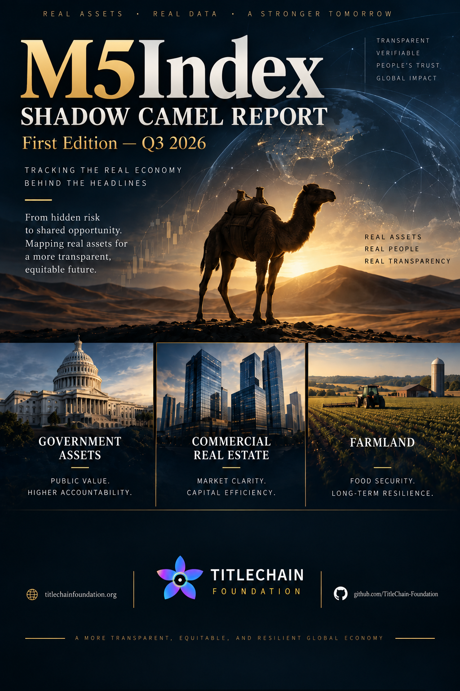

# SHADOW CAMEL Report — Q3 2026

> **Status: first-edition public-research release; preliminary and non-canonical.** The report publishes a methodology v0.1 system-level reading using public sources. Publication does not make the score official, regulatory, independently reproduced, or authoritative.

**TitleChain Foundation research concept and design (2026).** The cover is a report visual, not independent evidence.

## Download the report

- [Accessible PDF edition](M5Index_SHADOW_CAMEL_Report_Q3_2026.pdf)
- [Editable Word edition](M5Index_SHADOW_CAMEL_Report_Q3_2026.docx)

The 23-page report is titled **M5Index — SHADOW CAMEL REPORT, First Edition — Q3 2026**. Its PDF and DOCX include the report body, source links, methodology and confidence labels, report charts, the 36-record asset appendix, and public contribution guidance.

## Preliminary reading

The report presents a **preliminary SHADOW CAMEL score of 1.8 / 5 — Band 2 (Stable / Watch)** with confidence **B** and methodology **v0.1**. This is a published research output, not a `CANONICAL` evidence state or an independently reproduced result.

SHADOW CAMEL is an experimental public-data methodology. It is not an official CAMELS rating, confidential regulatory CAMELS rating, bank examination, regulator finding, investment recommendation, credit rating, legal conclusion, or claim that confidential supervisory information has been obtained. Its `M*` and `S*` components are explicitly public-data proxies or inferences.

## Evidence and limitations

The report cites public Federal Reserve, FDIC, Trepp, and GSA sources and states that the asset appendix is based on `SHADOW_M5Index_Master_Dataset_v0.1.xlsx`. The repository continues to preserve these boundaries:

- `SUBMITTED` and `SOURCE_VERIFIED` remain below `CANONICAL`;
- unknown title, buyer, lender, rights, environmental, and capital fields remain unresolved;
- publication does not establish complete title, authority, acquisition readiness, or a transaction;
- the composite score has not been independently reproduced in this repository; and
- corrections and superseding editions must preserve prior report provenance.

Use the maintained [v0.1 dataset guide](../data/README.md), [methodology boundary](../methodology/README.md), and [public ingestion architecture](../../docs/SHADOW-M5INDEX-PUBLIC-INGESTION-AND-QR.md) when reviewing claims.

## Help improve the index

Public contributors can submit source-linked evidence for governed review:

- **[Nominate a public asset](https://github.com/TitleChain-Foundation/M5-AI-Sovereign-Commons/issues/new?template=shadow-new-asset.yml)**
- **[Add registry or public-record evidence](https://github.com/TitleChain-Foundation/M5-AI-Sovereign-Commons/issues/new?template=shadow-add-evidence.yml)**
- **[Challenge or correct an index record](https://github.com/TitleChain-Foundation/M5-AI-Sovereign-Commons/issues/new?template=shadow-correction.yml)**

A submission enters review as `SUBMITTED`; it does not become `CANONICAL` without verification and attributable approval. Never submit credentials, private title files, nonpublic banking information, personal data, private M5POD evidence, production endpoints, or material you are not authorized to publish.

## Join and support the Commons

- [Set up the free IAM starting account](https://m5bank.app/)
- [Join the public M5POD waitlist](https://m5podactivationdemo.netlify.app/)
- [Join the TitleChain Foundation public discussion](https://github.com/orgs/TitleChain-Foundation/discussions/23)
- [Read the contribution requirements](../../CONTRIBUTING.md)

Joining, waiting, discussing, or submitting evidence does not create a credential, membership, title, investment right, bank relationship, project role, or authority.

## Release provenance

| Artifact | SHA-256 |
| --- | --- |
| PDF | `363c2527ff153b5f5b1d2ca993ef129c5ee3a4bca2b6ee207000c96c61061000` |
| Editable DOCX | `1a5633c25fad9895eacdc29fe56cbae349c3462fc7e6e3f16d63b5d6c1ec2f0d` |
| Cover embedded in the report | `a63b06e35ccb7733a464612f7d3a4e399192fc98b266467adbc3c21ab4a2230a` |
| Reviewed source archive | `2cfa5d8d8ef348d391b25b8fad173ac4f87082e5ada33bc514a81f88cb947a3b` |
| Full downloaded project ZIP | `53de65fd61ba2595d86eb921fd1723e93d9012d4f7b7aa2f7605790531674a6d` |

Reviewed and integrated September 22, 2026. The downloaded package’s substantive files passed its supplied SHA-256 checks; its self-referential `SHA256SUMS.txt` entry was excluded from reliance because a checksum file cannot stably authenticate its own final bytes.
