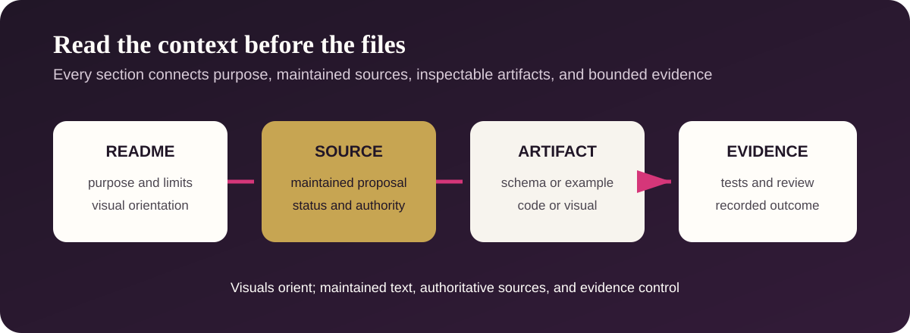

# Tests and Validation



This folder contains the public schema-conformance tests. The broader
provider-neutral governor regression suite remains beside its implementation so
reviewers can inspect code and evidence together.

Tests provide reproducible evidence for bounded cases. A passing result does
not establish that a record is true, an actor has authority, a deployment is
secure, a system complies with law, or the release is production-ready.

## Explore this section

| Test surface | What it checks | Location |
| --- | --- | --- |
| Schema and example pairs | Exactly eight named pairs, Draft 2020-12 validity, required fields, unknown fields, and selected fail-closed cases | [Schema tests](test_schemas.py) |
| Provider-neutral governor | Budget projection, ledger integrity, provider adapters, and shared control behavior | [Governor tests](../reference-implementation/provider-neutral-governor/tests/) |
| Recorded release evidence | Dated results, scope, and explicit non-claims | [Validation report](../VALIDATION-REPORT.md) |

## Run the focused public suite

From the repository root:

```text
python -m pytest tests/test_schemas.py reference-implementation/provider-neutral-governor/tests
```

Review failures against the relevant [standard](../standards/README.md),
[schema](../schemas/README.md), and [synthetic example](../examples/README.md)
before proposing a change.
